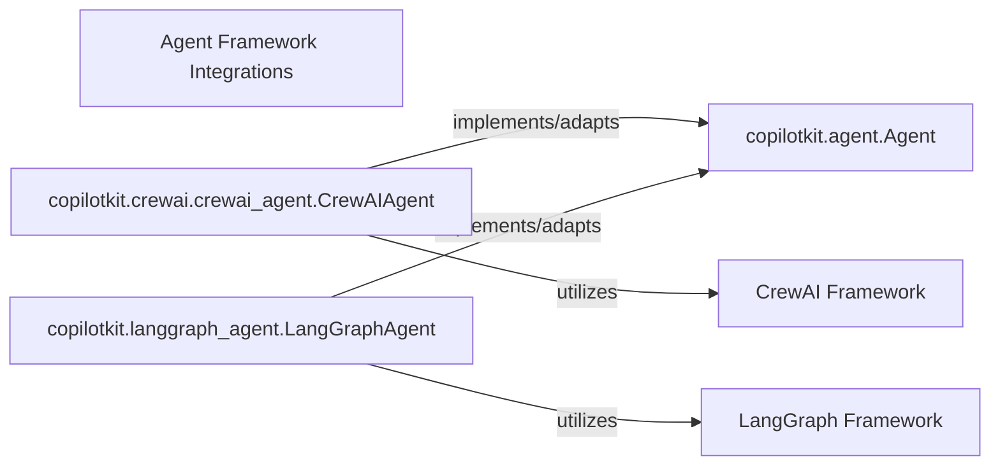

## Details

Abstract Components Overview

### Agent Framework Integrations [[Expand]](./Agent_Framework_Integrations.md)
This component is responsible for integrating external AI agent frameworks like LangGraph and CrewAI into CopilotKit. It provides specific adapters and wrappers that translate the functionalities of these frameworks into a unified `Agent Abstraction Layer`, ensuring seamless interoperability within the CopilotKit ecosystem. This allows CopilotKit to leverage diverse agent capabilities without being tightly coupled to any single framework.

**Related Classes/Methods**:

- <a href="https://github.com/CopilotKit/CopilotKit/blob/main/sdk-python/copilotkit/agent.py#L14-L65" target="_blank" rel="noopener noreferrer">`copilotkit.agent.Agent` (14:65)</a>
- <a href="https://github.com/CopilotKit/CopilotKit/blob/main/sdk-python/copilotkit/crewai/crewai_agent.py#L1-L1" target="_blank" rel="noopener noreferrer">`copilotkit.crewai.crewai_agent.CrewAIAgent` (1:1)</a>
- <a href="https://github.com/CopilotKit/CopilotKit/blob/main/sdk-python/copilotkit/langgraph_agent.py#L84-L717" target="_blank" rel="noopener noreferrer">`copilotkit.langgraph_agent.LangGraphAgent` (84:717)</a>
- <a href="https://github.com/CopilotKit/CopilotKit/blob/main/sdk-python/copilotkit/langgraph.py#L1-L1" target="_blank" rel="noopener noreferrer">`copilotkit.langgraph` (1:1)</a>
- `copilotkit.crewai` (1:1)

### copilotkit.agent.Agent
Defines the common interface and contract for all agents integrated into CopilotKit. It acts as the target abstraction that external agent frameworks must conform to.

**Related Classes/Methods**:

- <a href="https://github.com/CopilotKit/CopilotKit/blob/main/sdk-python/copilotkit/agent.py#L14-L65" target="_blank" rel="noopener noreferrer">`copilotkit.agent.Agent` (14:65)</a>

### copilotkit.crewai.crewai_agent.CrewAIAgent
This component specifically adapts the CrewAI framework's functionalities to adhere to the `copilotkit.agent.Agent` interface. It encapsulates CrewAI-specific logic and exposes it through the generic agent abstraction.

**Related Classes/Methods**:

- <a href="https://github.com/CopilotKit/CopilotKit/blob/main/sdk-python/copilotkit/crewai/crewai_agent.py#L1-L1" target="_blank" rel="noopener noreferrer">`copilotkit.crewai.crewai_agent.CrewAIAgent` (1:1)</a>

### copilotkit.langgraph_agent.LangGraphAgent
Similar to the CrewAI adapter, this component adapts the LangGraph framework to the `copilotkit.agent.Agent` interface. It handles LangGraph-specific workflows and exposes them uniformly.

**Related Classes/Methods**:

- <a href="https://github.com/CopilotKit/CopilotKit/blob/main/sdk-python/copilotkit/langgraph_agent.py#L84-L717" target="_blank" rel="noopener noreferrer">`copilotkit.langgraph_agent.LangGraphAgent` (84:717)</a>

### CrewAI Framework
An external AI agent framework utilized by CopilotKit's `CrewAIAgent`.

**Related Classes/Methods**: _None_

### LangGraph Framework
An external AI agent framework utilized by CopilotKit's `LangGraphAgent`.

**Related Classes/Methods**: _None_

### [FAQ](https://github.com/CodeBoarding/GeneratedOnBoardings/tree/main?tab=readme-ov-file#faq)