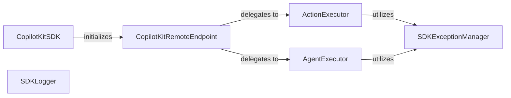

## Details

The `CopilotKit SDK` subsystem is designed to provide a robust and extensible programmatic interface for developers building AI/ML applications. Its architecture prioritizes modularity and clear separation of concerns, enabling seamless integration and management of AI agents and actions.

### CopilotKitSDK
Serves as the primary entry point for developers, responsible for initializing the SDK, configuring global settings, and orchestrating interactions with the underlying runtime and agent systems. It acts as the facade for the entire SDK.

**Related Classes/Methods**:

- `sdk-python/copilotkit/sdk.py`

### CopilotKitRemoteEndpoint
Manages all communication with the remote backend services, including AI model execution, agent orchestration, and data exchange. It handles the network layer and serialization/deserialization of requests and responses.

**Related Classes/Methods**:

- `CopilotKitRemoteEndpoint` (1:1)

### ActionExecutor
Encapsulates the logic for managing and executing developer-defined actions within the AI application. It handles the lifecycle of actions, including registration, invocation, and result processing.

**Related Classes/Methods**:

- `ActionExecutor` (1:1)

### AgentExecutor
Manages the execution flow and lifecycle of AI agents. This includes orchestrating agent behaviors, managing their state, and facilitating their interactions with actions and other components.

**Related Classes/Methods**:

- `AgentExecutor` (1:1)

### SDKLogger
Provides centralized logging capabilities for the entire SDK. It captures operational events, debugging information, and errors, aiding in monitoring and troubleshooting.

**Related Classes/Methods**:

- `SDKLogger` (1:1)

### SDKExceptionManager
Centralizes the handling and management of exceptions and errors within the SDK. It ensures consistent error reporting and allows for graceful degradation or recovery mechanisms.

**Related Classes/Methods**:

- `SDKExceptionManager` (1:1)

### [FAQ](https://github.com/CodeBoarding/GeneratedOnBoardings/tree/main?tab=readme-ov-file#faq)