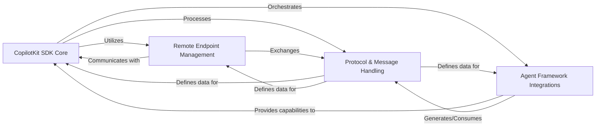

## Details

The `CopilotKit SDK Core` subsystem is designed as the primary programmatic interface for developers integrating AI capabilities into their backend applications. It adheres to Software Development Kit (SDK) and Framework patterns by providing a structured, extensible, and easy-to-use API for orchestrating AI interactions, managing agent lifecycles, and handling communication with the CopilotKit runtime.

### CopilotKit SDK Core [[Expand]](./CopilotKit_SDK_Core.md)
This is the central component of the Python SDK, serving as the main entry point for developers. It orchestrates AI capabilities, manages the lifecycle of various agents, and provides a unified API for integrating CopilotKit into backend applications. It is responsible for initiating and managing AI interactions, acting as the primary orchestrator of high-level AI workflows.

**Related Classes/Methods**:

- <a href="https://github.com/CopilotKit/CopilotKit/blob/main/sdk-python/copilotkit/sdk.py#L390-L400" target="_blank" rel="noopener noreferrer">`copilotkit.sdk.CopilotKitSDK` (390:400)</a>

### Remote Endpoint Management
This component is responsible for handling the communication with remote CopilotKit endpoints. It manages the underlying network interactions, data serialization/deserialization, and protocol adherence necessary for the SDK to interact with the CopilotKit backend runtime. It abstracts away the complexities of remote communication, allowing the SDK Core to focus on AI orchestration logic.

**Related Classes/Methods**:

- <a href="https://github.com/CopilotKit/CopilotKit/blob/main/sdk-python/copilotkit/sdk.py#L60-L387" target="_blank" rel="noopener noreferrer">`copilotkit.sdk.CopilotKitRemoteEndpoint` (60:387)</a>

### Agent Framework Integrations [[Expand]](./Agent_Framework_Integrations.md)
This component provides the necessary abstractions and concrete implementations for integrating various AI agent frameworks (e.g., LangGraph, CrewAI) with the CopilotKit SDK. It allows developers to leverage different agentic capabilities and workflows within their applications by providing a standardized interface for agent creation, execution, and interaction.

**Related Classes/Methods**:

- <a href="https://github.com/CopilotKit/CopilotKit/blob/main/sdk-python/copilotkit/agent.py#L14-L65" target="_blank" rel="noopener noreferrer">`copilotkit.agent.Agent` (14:65)</a>
- <a href="https://github.com/CopilotKit/CopilotKit/blob/main/sdk-python/copilotkit/crewai/crewai_agent.py#L1-L1" target="_blank" rel="noopener noreferrer">`copilotkit.crewai.crewai_agent.CrewAIAgent` (1:1)</a>
- <a href="https://github.com/CopilotKit/CopilotKit/blob/main/sdk-python/copilotkit/langgraph_agent.py#L84-L717" target="_blank" rel="noopener noreferrer">`copilotkit.langgraph_agent.LangGraphAgent` (84:717)</a>

### Protocol & Message Handling
This component defines the standardized data structures, message types, and communication protocols used throughout the CopilotKit ecosystem. It ensures consistent data exchange for various AI workflow events, such as action execution, result delivery, and text messages. It also defines meta-events for runtime communication.

**Related Classes/Methods**:

- <a href="https://github.com/CopilotKit/CopilotKit/blob/main/sdk-python/copilotkit/types.py#L23-L27" target="_blank" rel="noopener noreferrer">`copilotkit.types.ActionExecutionMessage` (23:27)</a>
- <a href="https://github.com/CopilotKit/CopilotKit/blob/main/sdk-python/copilotkit/types.py#L29-L33" target="_blank" rel="noopener noreferrer">`copilotkit.types.ResultMessage` (29:33)</a>
- <a href="https://github.com/CopilotKit/CopilotKit/blob/main/sdk-python/copilotkit/types.py#L17-L21" target="_blank" rel="noopener noreferrer">`copilotkit.types.TextMessage` (17:21)</a>
- <a href="https://github.com/CopilotKit/CopilotKit/blob/main/sdk-python/copilotkit/protocol.py#L1-L1" target="_blank" rel="noopener noreferrer">`copilotkit.protocol.RuntimeMetaEventName` (1:1)</a>

### [FAQ](https://github.com/CodeBoarding/GeneratedOnBoardings/tree/main?tab=readme-ov-file#faq)