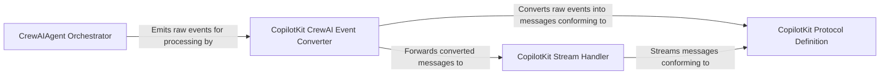

## Details

Abstract Components Overview

### CrewAIAgent Orchestrator
This component is responsible for managing the entire asynchronous execution lifecycle of CrewAI flows within CopilotKit. It handles the initiation of AI agent runs, tracks their progress, manages completion and error states, and emits internal CrewAI events to maintain an up-to-date state of the ongoing AI process. It acts as the central control point for CrewAI operations within CopilotKit.

**Related Classes/Methods**:

- <a href="https://github.com/CopilotKit/CopilotKit/blob/main/sdk-python/copilotkit/crewai/crewai_agent.py" target="_blank" rel="noopener noreferrer">`copilotkit.crewai.crewai_agent.CrewAIAgent`</a>

### CopilotKit CrewAI Event Converter
This component serves as a crucial bridge, translating various CrewAI-specific events and data (such as agent states, text messages, tool call details, and meta-events) into the standardized CopilotKit protocol. It ensures that information generated by CrewAI agents is correctly formatted and consumable by other CopilotKit components, facilitating interoperability and consistent data representation across the framework.

**Related Classes/Methods**:

- <a href="https://github.com/CopilotKit/CopilotKit/blob/main/sdk-python/copilotkit/protocol.py" target="_blank" rel="noopener noreferrer">`copilotkit.protocol`</a>

### CopilotKit Stream Handler
This component is dedicated to managing the real-time streaming of data generated by the CrewAI flow to the CopilotKit frontend or client. It takes raw stream data or converted messages and wraps them into appropriate CopilotKit protocol messages, ensuring efficient and structured delivery of live updates, such as agent thoughts, tool outputs, and final results.

**Related Classes/Methods**:

- <a href="https://github.com/CopilotKit/CopilotKit/blob/main/sdk-python/copilotkit/protocol.py" target="_blank" rel="noopener noreferrer">`copilotkit.protocol`</a>

### CopilotKit Protocol Definition
Defines the standardized protocol for CopilotKit, used for inter-component communication and streaming.

**Related Classes/Methods**:

- <a href="https://github.com/CopilotKit/CopilotKit/blob/main/sdk-python/copilotkit/protocol.py" target="_blank" rel="noopener noreferrer">`copilotkit.protocol`</a>

### [FAQ](https://github.com/CodeBoarding/GeneratedOnBoardings/tree/main?tab=readme-ov-file#faq)