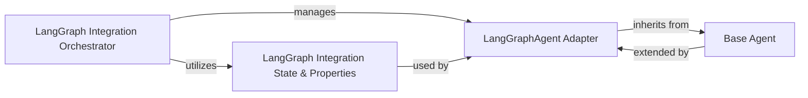

## Details

One paragraph explaining the functionality which is represented by this graph. What the main flow is and what is its purpose.

### LangGraph Integration Orchestrator
The primary component responsible for orchestrating the overall integration of LangGraph agents into the CopilotKit ecosystem. It acts as the high-level bridge, ensuring LangGraph's graph-based agents can be managed and executed within CopilotKit's runtime.

**Related Classes/Methods**:

- <a href="https://github.com/CopilotKit/CopilotKit/blob/main/sdk-python/copilotkit/langgraph.py#L1-L1000" target="_blank" rel="noopener noreferrer">`copilotkit.langgraph` (1:1000)</a>

### LangGraphAgent Adapter
This component serves as an adapter, specifically designed to wrap and integrate LangGraph agents into CopilotKit's agent management framework. It inherits from the base Agent component, allowing LangGraph agents to be treated as first-class citizens within CopilotKit, enabling their management and execution.

**Related Classes/Methods**:

- <a href="https://github.com/CopilotKit/CopilotKit/blob/main/sdk-python/copilotkit/langgraph_agent.py#L84-L716" target="_blank" rel="noopener noreferrer">`copilotkit.langgraph_agent.LangGraphAgent` (84:716)</a>

### Base Agent
The foundational abstract component defining the common interface and core functionalities for all agents within the CopilotKit framework. It establishes the contract that all specific agent implementations, including LangGraphAgent, must adhere to.

**Related Classes/Methods**:

- <a href="https://github.com/CopilotKit/CopilotKit/blob/main/sdk-python/copilotkit/agent.py#L14-L65" target="_blank" rel="noopener noreferrer">`copilotkit.agent.Agent` (14:65)</a>

### LangGraph Integration State & Properties
This component defines the specific data structures and configurations required for managing the state and properties of LangGraph agents within the CopilotKit environment. It ensures that LangGraph's unique state management and execution flow are correctly represented and handled by CopilotKit.

**Related Classes/Methods**:

- <a href="https://github.com/CopilotKit/CopilotKit/blob/main/sdk-python/copilotkit/langgraph.py#L1-L1000" target="_blank" rel="noopener noreferrer">`copilotkit.langgraph.CopilotKitProperties` (1:1000)</a>
- <a href="https://github.com/CopilotKit/CopilotKit/blob/main/sdk-python/copilotkit/langgraph.py#L1-L1000" target="_blank" rel="noopener noreferrer">`copilotkit.langgraph.CopilotKitState` (1:1000)</a>

### [FAQ](https://github.com/CodeBoarding/GeneratedOnBoardings/tree/main?tab=readme-ov-file#faq)