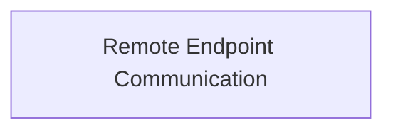

## Details

One paragraph explaining the functionality which is represented by this graph. What the main flow is and what is its purpose.

### Remote Endpoint Communication [[Expand]](./Remote_Endpoint_Communication.md)
This component is the backbone for all network-level interactions within the SDK. It manages the secure and efficient exchange of data, including API requests, responses, and the necessary serialization/deserialization processes, between the SDK and external CopilotKit services or various AI providers. Its primary role is to ensure reliable and structured communication with remote endpoints.

**Related Classes/Methods**:

- <a href="https://github.com/CopilotKit/CopilotKit/blob/main/sdk-python/copilotkit/protocol.py#L1-L100" target="_blank" rel="noopener noreferrer">`copilotkit.protocol` (1:100)</a>
- <a href="https://github.com/CopilotKit/CopilotKit/blob/main/sdk-python/copilotkit/sdk.py#L60-L387" target="_blank" rel="noopener noreferrer">`copilotkit.sdk.CopilotKitRemoteEndpoint` (60:387)</a>

### [FAQ](https://github.com/CodeBoarding/GeneratedOnBoardings/tree/main?tab=readme-ov-file#faq)