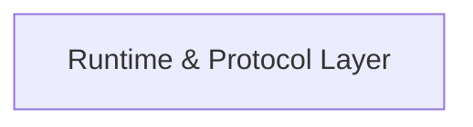

## Details

One paragraph explaining the functionality which is represented by this graph. What the main flow is and what is its purpose.

### Runtime & Protocol Layer [[Expand]](./Runtime_Protocol_Layer.md)
This layer serves as the operational backbone of CopilotKit, orchestrating the execution lifecycle of AI agents and managing the communication protocols vital for seamless data flow, particularly in remote operations. It acts as the central hub for interactions within the framework, ensuring robust and efficient communication.

**Related Classes/Methods**:

- <a href="https://github.com/CopilotKit/CopilotKit/blob/main/sdk-python/copilotkit/protocol.py" target="_blank" rel="noopener noreferrer">`copilotkit.protocol.RuntimeMetaEventName`</a>
- <a href="https://github.com/CopilotKit/CopilotKit/blob/main/sdk-python/copilotkit/protocol.py" target="_blank" rel="noopener noreferrer">`copilotkit.protocol.MetaEvent`</a>
- <a href="https://github.com/CopilotKit/CopilotKit/blob/main/sdk-python/copilotkit/types.py#L23-L27" target="_blank" rel="noopener noreferrer">`copilotkit.types.ActionExecutionMessage` (23:27)</a>
- <a href="https://github.com/CopilotKit/CopilotKit/blob/main/sdk-python/copilotkit/types.py#L29-L33" target="_blank" rel="noopener noreferrer">`copilotkit.types.ResultMessage` (29:33)</a>
- <a href="https://github.com/CopilotKit/CopilotKit/blob/main/sdk-python/copilotkit/types.py#L17-L21" target="_blank" rel="noopener noreferrer">`copilotkit.types.TextMessage` (17:21)</a>
- <a href="https://github.com/CopilotKit/CopilotKit/blob/main/sdk-python/copilotkit/types.py#L6-L10" target="_blank" rel="noopener noreferrer">`copilotkit.types.MessageRole` (6:10)</a>

### [FAQ](https://github.com/CodeBoarding/GeneratedOnBoardings/tree/main?tab=readme-ov-file#faq)