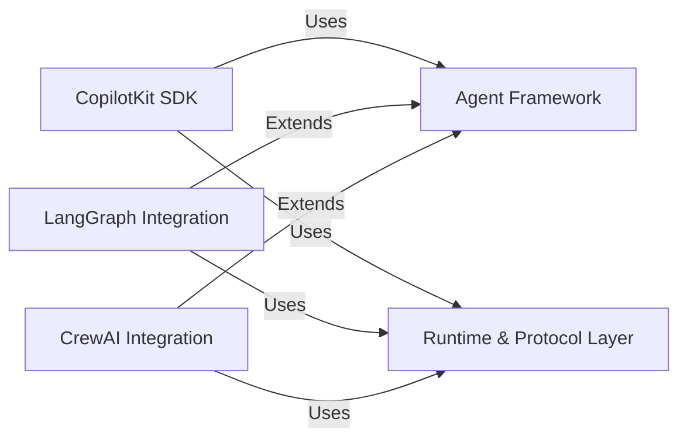

## Details

One paragraph explaining the functionality which is represented by this graph. What the main flow is and what is its purpose.

### CopilotKit SDK [[Expand]](./CopilotKit_SDK.md)
This component serves as the primary programmatic interface for developers, providing core functionalities for initializing the framework, configuring settings, and managing interactions with the underlying agent and runtime systems.

**Related Classes/Methods**:

- `sdk-python/copilotkit/sdk.py`

### Agent Framework [[Expand]](./Agent_Framework.md)
This foundational component defines the core abstractions and extensible interfaces for AI agents within CopilotKit. It includes base classes for agents, mechanisms for defining actions, and managing parameters, enabling a modular approach to agent development.

**Related Classes/Methods**:

- `sdk-python/copilotkit/agent.py`

### Runtime & Protocol Layer [[Expand]](./Runtime_Protocol_Layer.md)
Responsible for the operational backbone of CopilotKit, this component manages the execution lifecycle of agents and handles the communication protocols. It ensures seamless data flow and interaction between various parts of the framework, particularly for remote operations.

**Related Classes/Methods**:

- <a href="https://github.com/CopilotKit/CopilotKit/blob/main/sdk-python/copilotkit/protocol.py#L1-L1" target="_blank" rel="noopener noreferrer">`sdk-python/copilotkit/protocol.py` (1:1)</a>

### LangGraph Integration [[Expand]](./LangGraph_Integration.md)
A specialized extension that integrates agents built using the LangGraph library into the CopilotKit ecosystem. It adapts LangGraph's unique graph-based agent constructs to leverage CopilotKit's runtime and agent management capabilities.

**Related Classes/Methods**:

- <a href="https://github.com/CopilotKit/CopilotKit/blob/main/sdk-python/copilotkit/langgraph.py#L1-L1" target="_blank" rel="noopener noreferrer">`sdk-python/copilotkit/langgraph.py` (1:1)</a>

### CrewAI Integration [[Expand]](./CrewAI_Integration.md)
This component provides seamless integration for AI agents developed with the CrewAI framework. It includes necessary adapters and SDK components, allowing CrewAI-based agents to utilize CopilotKit's core functionalities and runtime environment.

**Related Classes/Methods**:

- <a href="https://github.com/CopilotKit/CopilotKit/blob/main/sdk-python/copilotkit/crewai/crewai_sdk.py#L1-L1" target="_blank" rel="noopener noreferrer">`sdk-python/copilotkit/crewai/crewai_sdk.py` (1:1)</a>

### [FAQ](https://github.com/CodeBoarding/GeneratedOnBoardings/tree/main?tab=readme-ov-file#faq)