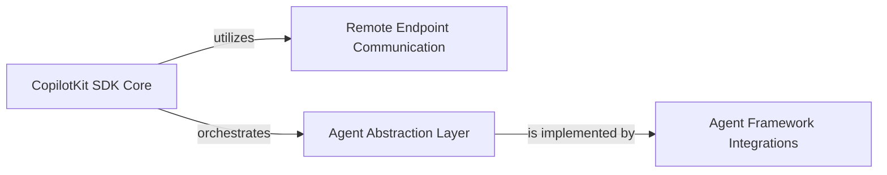

## Details

One paragraph explaining the functionality which is represented by this graph. What the main flow is and what is its purpose.

### CopilotKit SDK Core [[Expand]](./CopilotKit_SDK_Core.md)
The central programmatic interface for developers, orchestrating AI capabilities, managing agent lifecycles, and providing a unified API for integrating CopilotKit into backend applications. It acts as the primary orchestrator of AI interactions.

**Related Classes/Methods**:

- `copilotkit.sdk`

### Remote Endpoint Communication [[Expand]](./Remote_Endpoint_Communication.md)
Responsible for all network-level communication, handling API requests, responses, and data serialization/deserialization between the SDK and external CopilotKit services or AI providers. It ensures secure and efficient data exchange.

**Related Classes/Methods**:

- <a href="https://github.com/CopilotKit/CopilotKit/blob/main/sdk-python/copilotkit/protocol.py#L1-L1" target="_blank" rel="noopener noreferrer">`copilotkit.protocol` (1:1)</a>

### Agent Abstraction Layer [[Expand]](./Agent_Abstraction_Layer.md)
Defines a standardized interface or contract for all AI agents within the CopilotKit ecosystem. This layer ensures interoperability, allowing the SDK Core to interact uniformly with diverse agent frameworks.

**Related Classes/Methods**:

- `copilotkit.agent`

### Agent Framework Integrations [[Expand]](./Agent_Framework_Integrations.md)
Contains specific adapters and wrappers (e.g., for LangGraph, CrewAI) that enable popular AI agent frameworks to conform to the Agent Abstraction Layer. This component facilitates the seamless integration and utilization of various agent technologies within CopilotKit.

**Related Classes/Methods**:

- <a href="https://github.com/CopilotKit/CopilotKit/blob/main/sdk-python/copilotkit/langgraph.py#L1-L1" target="_blank" rel="noopener noreferrer">`copilotkit.langgraph` (1:1)</a>
- `copilotkit.crewai` (1:1)

### [FAQ](https://github.com/CodeBoarding/GeneratedOnBoardings/tree/main?tab=readme-ov-file#faq)