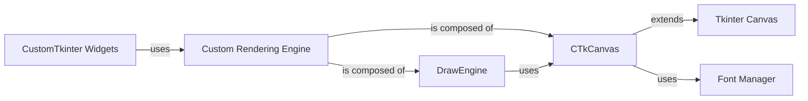

## Component Details

Analysis of the CustomTkinter's Custom Rendering Engine, detailing its core components (DrawEngine, CTkCanvas) and their relationships, as well as its interactions with other parts of the CustomTkinter library and external dependencies like Tkinter Canvas and a Font Manager.

### Custom Rendering Engine
This component is fundamental to CustomTkinter's unique visual identity, handling all custom graphical rendering. It comprises DrawEngine, which offers a comprehensive set of methods for drawing complex shapes such as rounded rectangles, progress bars, and sliders with anti-aliasing. CTkCanvas, a specialized tkinter.Canvas subclass, directly integrates with DrawEngine to execute these custom drawing operations, leveraging Tkinter's primitive shapes and text functionalities to achieve sophisticated visual effects.

**Related Classes/Methods**:

- <a href="https://github.com/TomSchimansky/CustomTkinter/blob/master/customtkinter/windows/widgets/core_rendering/draw_engine.py#L10-L1234" target="_blank" rel="noopener noreferrer">`customtkinter.windows.widgets.core_rendering.draw_engine.DrawEngine` (10:1234)</a>
- <a href="https://github.com/TomSchimansky/CustomTkinter/blob/master/customtkinter/windows/widgets/core_rendering/ctk_canvas.py#L5-L116" target="_blank" rel="noopener noreferrer">`customtkinter.windows.widgets.core_rendering.ctk_canvas.CTkCanvas` (5:116)</a>

### DrawEngine
The core logic component of the Custom Rendering Engine. It provides a suite of methods (draw_rounded_rect_with_border, draw_rounded_progress_bar_with_border, draw_rounded_slider_with_border_and_button, draw_rounded_scrollbar, draw_checkmark, draw_dropdown_arrow) for rendering CustomTkinter's unique shapes. It manages different drawing strategies (e.g., polygon_shapes, font_shapes, circle_shapes) and optimizes parameters like corner radii for visual quality across platforms.

**Related Classes/Methods**:

- <a href="https://github.com/TomSchimansky/CustomTkinter/blob/master/customtkinter/windows/widgets/core_rendering/draw_engine.py#L10-L1234" target="_blank" rel="noopener noreferrer">`customtkinter.windows.widgets.core_rendering.draw_engine.DrawEngine` (10:1234)</a>

### CTkCanvas
A specialized tkinter.Canvas subclass that serves as the drawing surface for DrawEngine. Its primary enhancement is the ability to draw anti-aliased circles and other shapes, particularly on Windows and Linux, by utilizing a custom font (CustomTkinter_shapes_font) and mapping circle radii to specific font characters. It overrides standard tkinter.Canvas methods like coords and itemconfig to correctly manipulate these custom anti-aliased elements.

**Related Classes/Methods**:

- <a href="https://github.com/TomSchimansky/CustomTkinter/blob/master/customtkinter/windows/widgets/core_rendering/ctk_canvas.py#L5-L116" target="_blank" rel="noopener noreferrer">`customtkinter.windows.widgets.core_rendering.ctk_canvas.CTkCanvas` (5:116)</a>

### Tkinter Canvas
Standard Tkinter Canvas functionality, extended by CTkCanvas.

**Related Classes/Methods**: _None_

### CustomTkinter Widgets
Various CustomTkinter widgets (e.g., CTkButton, CTkSlider, CTkProgressBar) that instantiate and rely on the DrawEngine and CTkCanvas to render their unique visual appearances.

**Related Classes/Methods**: _None_

### Font Manager
Component responsible for loading and managing custom fonts, specifically CustomTkinter_shapes_font used by CTkCanvas for anti-aliasing.

**Related Classes/Methods**: _None_

### [FAQ](https://github.com/CodeBoarding/GeneratedOnBoardings/tree/main?tab=readme-ov-file#faq)