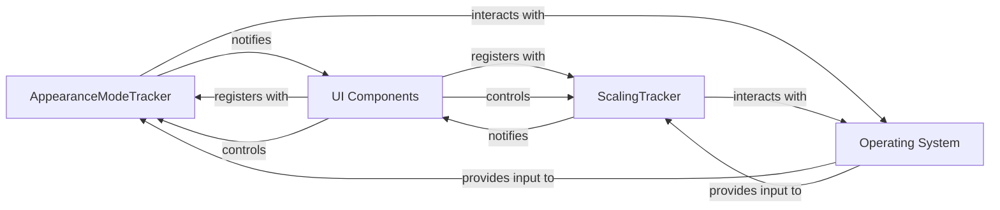

## Component Details

The Global UI State Management component in CustomTkinter is crucial for maintaining a consistent and adaptive user interface across different operating systems and display configurations. It achieves this by centralizing the management of two key UI properties: appearance mode (light/dark) and UI scaling.

### AppearanceModeTracker
This singleton class is responsible for managing the application's global appearance mode (light or dark). It can detect the system's appearance mode and allows for manual setting. It maintains a list of registered UI components (widgets and windows) and notifies them to update their visual theme when the mode changes.

**Related Classes/Methods**:

- <a href="https://github.com/TomSchimansky/CustomTkinter/blob/master/customtkinter/windows/widgets/appearance_mode/appearance_mode_tracker.py#L5-L121" target="_blank" rel="noopener noreferrer">`customtkinter.windows.widgets.appearance_mode.appearance_mode_tracker.AppearanceModeTracker` (5:121)</a>

### ScalingTracker
This singleton class manages global UI scaling based on system DPI and user-defined factors. It ensures consistent sizing and appearance of UI elements across different displays and resolutions. It maintains a list of registered UI components (widgets and windows) and notifies them to update their dimensions when scaling changes. It also handles DPI awareness for Windows.

**Related Classes/Methods**:

- <a href="https://github.com/TomSchimansky/CustomTkinter/blob/master/customtkinter/windows/widgets/scaling/scaling_tracker.py#L5-L205" target="_blank" rel="noopener noreferrer">`customtkinter.windows.widgets.scaling.scaling_tracker.ScalingTracker` (5:205)</a>

### UI Components
This represents the core UI elements of CustomTkinter that are affected by global UI state. CTk is the main application window, and CTkToplevel are secondary windows. CTkBaseClass is the foundational class for most CustomTkinter widgets. These classes inherit from base classes that allow them to register with and receive updates from AppearanceModeTracker and ScalingTracker. They also provide methods for users to manually set appearance mode and scaling, which in turn updates the respective trackers.

**Related Classes/Methods**:

- <a href="https://github.com/TomSchimansky/CustomTkinter/blob/master/customtkinter/windows/ctk_tk.py#L17-L332" target="_blank" rel="noopener noreferrer">`customtkinter.windows.ctk_tk.CTk` (17:332)</a>
- <a href="https://github.com/TomSchimansky/CustomTkinter/blob/master/customtkinter/windows/ctk_toplevel.py#L15-L306" target="_blank" rel="noopener noreferrer">`customtkinter.windows.ctk_toplevel.CTkToplevel` (15:306)</a>
- `customtkinter.windows.widgets.ctk_base_class.CTkBaseClass` (0:0)

### Operating System
The underlying external environment that provides system-level information crucial for global UI state management, such as the current system-wide appearance mode (light/dark) and display DPI settings. It also manages high DPI awareness for the application.

**Related Classes/Methods**: _None_

### [FAQ](https://github.com/CodeBoarding/GeneratedOnBoardings/tree/main?tab=readme-ov-file#faq)