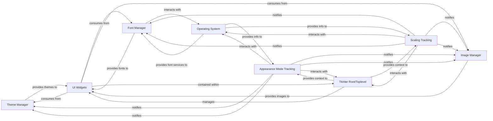

## Component Details

This component is dedicated to loading, managing, and providing the custom visual resources that define CustomTkinter's aesthetic. It encompasses theme management, font handling, and image scaling. The `Theme Manager` loads and provides access to color themes for various UI elements across different appearance modes. The `Font Manager` (represented by `CTkFont` and `FontManager`) manages custom font instances, ensuring they are correctly scaled and applied. The `Image Manager` (`CTkImage`) handles custom image objects, ensuring they are properly scaled for high-DPI displays. Together, these components ensure a consistent and scalable visual style.

### Theme Manager
Responsible for loading, managing, and providing access to color themes for various UI elements across different appearance modes (light/dark). It ensures a consistent visual style by centralizing theme data.

**Related Classes/Methods**:

- <a href="https://github.com/TomSchimansky/CustomTkinter/blob/master/customtkinter/windows/widgets/theme/theme_manager.py#L0-L0" target="_blank" rel="noopener noreferrer">`customtkinter/windows/widgets/theme/theme_manager.py` (0:0)</a>

### Font Manager
Manages custom font instances (`CTkFont`) and handles system-level font loading (`FontManager`), ensuring fonts are correctly scaled for high-DPI displays and applied consistently across UI elements.

**Related Classes/Methods**:

- <a href="https://github.com/TomSchimansky/CustomTkinter/blob/master/customtkinter/windows/widgets/font/ctk_font.py#L0-L0" target="_blank" rel="noopener noreferrer">`customtkinter/windows/widgets/font/ctk_font.py` (0:0)</a>
- <a href="https://github.com/TomSchimansky/CustomTkinter/blob/master/customtkinter/windows/widgets/font/font_manager.py#L0-L0" target="_blank" rel="noopener noreferrer">`customtkinter/windows/widgets/font/font_manager.py` (0:0)</a>

### Image Manager
Handles custom image objects (`CTkImage`), ensuring they are properly loaded, scaled for high-DPI displays, and managed efficiently for use in UI elements, including support for light and dark mode variations.

**Related Classes/Methods**:

- <a href="https://github.com/TomSchimansky/CustomTkinter/blob/master/customtkinter/windows/widgets/image/ctk_image.py#L0-L0" target="_blank" rel="noopener noreferrer">`customtkinter/windows/widgets/image/ctk_image.Lpy` (0:0)</a>

### Appearance Mode Tracking
Manages and tracks the application's appearance mode (light or dark), detecting system changes and allowing manual setting. It notifies registered components to update their visual theme.

**Related Classes/Methods**:

- <a href="https://github.com/TomSchimansky/CustomTkinter/blob/master/customtkinter/windows/widgets/appearance_mode/appearance_mode_tracker.py#L0-L0" target="_blank" rel="noopener noreferrer">`customtkinter/windows/widgets/appearance_mode/appearance_mode_tracker.py` (0:0)</a>

### Scaling Tracking
Manages and tracks DPI scaling for CustomTkinter windows and widgets, automatically detecting display DPI and applying appropriate scaling to UI elements.

**Related Classes/Methods**:

- <a href="https://github.com/TomSchimansky/CustomTkinter/blob/master/customtkinter/windows/widgets/scaling/scaling_tracker.py#L0-L0" target="_blank" rel="noopener noreferrer">`customtkinter/windows/widgets/scaling/scaling_tracker.py` (0:0)</a>

### UI Widgets
Represents the various CustomTkinter UI elements (buttons, labels, frames, etc.) that consume visual assets (themes, fonts, images) and respond to appearance mode and scaling changes. These are the visible, interactive parts of the application.

**Related Classes/Methods**:

- <a href="https://github.com/TomSchimansky/CustomTkinter/blob/master/customtkinter/windows/widgets/ctk_button.py#L0-L0" target="_blank" rel="noopener noreferrer">`customtkinter/windows/widgets/ctk_button.py` (0:0)</a>
- <a href="https://github.com/TomSchimansky/CustomTkinter/blob/master/customtkinter/windows/widgets/ctk_label.py#L0-L0" target="_blank" rel="noopener noreferrer">`customtkinter/windows/widgets/ctk_label.py` (0:0)</a>
- <a href="https://github.com/TomSchimansky/CustomTkinter/blob/master/customtkinter/windows/widgets/ctk_frame.py#L0-L0" target="_blank" rel="noopener noreferrer">`customtkinter/windows/widgets/ctk_frame.py` (0:0)</a>

### Tkinter Root/Toplevel
Represents the main Tkinter application window or a Toplevel window, serving as the root for UI elements and providing the context for system-level interactions like DPI and appearance mode detection.

**Related Classes/Methods**:

- <a href="https://github.com/TomSchimansky/CustomTkinter/blob/master/customtkinter/windows/ctk_tk.py#L0-L0" target="_blank" rel="noopener noreferrer">`customtkinter/windows/ctk_tk.py` (0:0)</a>
- <a href="https://github.com/TomSchimansky/CustomTkinter/blob/master/customtkinter/windows/ctk_toplevel.py#L0-L0" target="_blank" rel="noopener noreferrer">`customtkinter/windows/ctk_toplevel.py` (0:0)</a>

### Operating System
The underlying operating system that provides system-level information such as DPI settings and manages high DPI awareness for the application. This is an external dependency that influences CustomTkinter's visual behavior.

**Related Classes/Methods**: _None_

### [FAQ](https://github.com/CodeBoarding/GeneratedOnBoardings/tree/main?tab=readme-ov-file#faq)