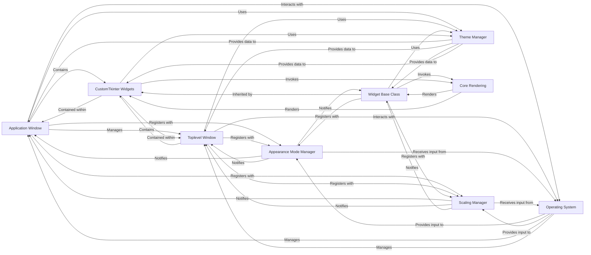

## Component Details

The `Window & Application Core` component forms the bedrock of any CustomTkinter application, providing the fundamental structures for UI display and interaction. It is crucial because it encapsulates the main application window, secondary pop-up windows, and the abstract base class that imbues all CustomTkinter widgets with core functionalities like appearance mode adaptation and scaling. Without these components, a CustomTkinter application would lack its visual container, its ability to manage multiple windows, and the consistent, adaptive behavior of its UI elements.

### Application Window
This is the primary, top-level window for any CustomTkinter application, represented by the `CTk` class. It initializes the main event loop, manages its own lifecycle, and handles system-level properties such as title bar customization (e.g., dark mode on Windows/macOS). It acts as the root container for all other UI elements and integrates deeply with global UI managers for consistent appearance and scaling.

**Related Classes/Methods**:

- `CTk` (1:1)

### Toplevel Window
Represents a secondary, independent pop-up window within a CustomTkinter application, implemented by the `CTkToplevel` class. It shares similar lifecycle management and property handling with the main application window (`CTk`), including title bar customization and integration with global UI managers for consistent appearance and scaling.

**Related Classes/Methods**:

- `CTkToplevel` (1:1)

### Widget Base Class
An abstract foundational class, `CTkBaseClass`, from which nearly all CustomTkinter widgets inherit. It provides common functionalities essential for widget behavior, including dimension management, automatic background color detection from parent widgets, and mechanisms for triggering redraws. It serves as a crucial link, allowing individual widgets to register with and respond to global UI managers for appearance and scaling changes.

**Related Classes/Methods**:

- `CTkBaseClass` (1:1)

### Appearance Mode Manager
This singleton component (`AppearanceModeTracker`) is responsible for detecting, managing, and tracking the application's appearance mode (light or dark). It monitors system-wide appearance changes and allows for manual setting by the user. Upon a change, it notifies all registered callbacks (windows and widgets) to update their visual theme accordingly.

**Related Classes/Methods**:

- <a href="https://github.com/TomSchimansky/CustomTkinter/blob/master/customtkinter/windows/widgets/appearance_mode/appearance_mode_tracker.py#L5-L121" target="_blank" rel="noopener noreferrer">`AppearanceModeTracker` (5:121)</a>

### Scaling Manager
This singleton component (`ScalingTracker`) manages and tracks the DPI (Dots Per Inch) scaling for all CustomTkinter windows and widgets. It automatically detects the display's DPI scaling factor and applies appropriate scaling to UI elements, ensuring consistent sizing and appearance across different monitors and resolutions. It also provides methods for user-defined scaling adjustments.

**Related Classes/Methods**:

- <a href="https://github.com/TomSchimansky/CustomTkinter/blob/master/customtkinter/windows/widgets/scaling/scaling_tracker.py#L5-L205" target="_blank" rel="noopener noreferrer">`ScalingTracker` (5:205)</a>

### CustomTkinter Widgets
This represents the collection of all individual UI elements (e.g., `CTkButton`, `CTkLabel`, `CTkFrame`, etc.) that users interact with. Each widget inherits from `CTkBaseClass` and is designed to automatically adapt its appearance and size based on notifications received from the `Appearance Mode Manager` and `Scaling Manager`.

**Related Classes/Methods**:

- `CTkButton` (1:1)

### Theme Manager
This component (`ThemeManager`) is responsible for loading, managing, and providing theme-related data (colors, fonts, dimensions) to various UI elements. It acts as a central repository for design properties, ensuring that components can retrieve their visual attributes consistently based on the active theme.

**Related Classes/Methods**:

- <a href="https://github.com/TomSchimansky/CustomTkinter/blob/master/customtkinter/windows/widgets/theme/theme_manager.py#L7-L54" target="_blank" rel="noopener noreferrer">`ThemeManager` (7:54)</a>

### Operating System
The underlying operating system provides crucial system-level information, such as current DPI settings and the system's appearance mode (light/dark). It also manages high DPI awareness for the application and handles native window features like title bar customization.

**Related Classes/Methods**: _None_

### Core Rendering
This conceptual component encompasses the underlying drawing operations that render UI elements on the screen. While not a single class, its functionality is invoked by `CTkBaseClass` and individual `CustomTkinter Widgets` through methods like `_draw` to update their visual representation in response to changes in dimensions, appearance mode, or scaling.

**Related Classes/Methods**: _None_

### [FAQ](https://github.com/CodeBoarding/GeneratedOnBoardings/tree/main?tab=readme-ov-file#faq)