```mermaid
graph LR
    Window_Application_Core["Window & Application Core"]
    Custom_Rendering_Engine["Custom Rendering Engine"]
    Global_UI_State_Management["Global UI State Management"]
    Visual_Asset_Management["Visual Asset Management"]
    Utility_Services["Utility Services"]
    Window_Application_Core -- "Interacts with" --> Global_UI_State_Management
    Window_Application_Core -- "Utilizes" --> Visual_Asset_Management
    Custom_Rendering_Engine -- "Provides services to" --> Window_Application_Core
    Custom_Rendering_Engine -- "Receives instructions from" --> Window_Application_Core
    Global_UI_State_Management -- "Notifies" --> Window_Application_Core
    Global_UI_State_Management -- "Influences" --> Visual_Asset_Management
    Visual_Asset_Management -- "Provides resources to" --> Window_Application_Core
    Visual_Asset_Management -- "Responds to" --> Global_UI_State_Management
    Utility_Services -- "Supports" --> Window_Application_Core
    Utility_Services -- "Supports" --> Custom_Rendering_Engine
    click Window_Application_Core href "https://github.com/CodeBoarding/GeneratedOnBoardings/blob/main//CustomTkinter/Window_Application_Core.md" "Details"
    click Custom_Rendering_Engine href "https://github.com/CodeBoarding/GeneratedOnBoardings/blob/main//CustomTkinter/Custom_Rendering_Engine.md" "Details"
    click Global_UI_State_Management href "https://github.com/CodeBoarding/GeneratedOnBoardings/blob/main//CustomTkinter/Global_UI_State_Management.md" "Details"
    click Visual_Asset_Management href "https://github.com/CodeBoarding/GeneratedOnBoardings/blob/main//CustomTkinter/Visual_Asset_Management.md" "Details"
```

## Component Details

The architecture of `CustomTkinter` is designed around a modular approach, separating concerns into distinct, interacting components. Based on the Control Flow Graph (CFG) and Source Analysis, the following five fundamental components are identified as central to its operation:

### Window & Application Core
This component serves as the foundational layer for any CustomTkinter application. It encompasses the primary application window (`CTk`) and secondary pop-up windows (`CTkToplevel`), managing their lifecycle, system-level properties (like title bar customization), and the main event loop. Crucially, it also includes `CTkBaseClass`, the abstract base class from which nearly all CustomTkinter widgets inherit. This base class provides common functionalities such as dimension management, color detection from parent widgets, and mechanisms for triggering redraws, acting as the central point for widgets to interact with global UI managers.

**Related Classes/Methods**:

- <a href="https://github.com/TomSchimansky/CustomTkinter/blob/master/customtkinter/windows/ctk_tk.py#L17-L332" target="_blank" rel="noopener noreferrer">`customtkinter.windows.ctk_tk.CTk` (17:332)</a>
- <a href="https://github.com/TomSchimansky/CustomTkinter/blob/master/customtkinter/windows/ctk_toplevel.py#L15-L306" target="_blank" rel="noopener noreferrer">`customtkinter.windows.ctk_toplevel.CTkToplevel` (15:306)</a>
- <a href="https://github.com/TomSchimansky/CustomTkinter/blob/master/customtkinter/windows/widgets/core_widget_classes/ctk_base_class.py#L22-L325" target="_blank" rel="noopener noreferrer">`customtkinter.windows.widgets.core_widget_classes.ctk_base_class.CTkBaseClass` (22:325)</a>

### Custom Rendering Engine
This component is the core of CustomTkinter's unique visual identity, responsible for all custom graphical rendering. `DrawEngine` provides a comprehensive suite of methods for drawing complex shapes like rounded rectangles, progress bars, and sliders with anti-aliasing. `CTkCanvas`, a specialized `tkinter.Canvas`, integrates directly with `DrawEngine` to execute these custom drawing operations, manipulating primitive shapes and text to achieve the desired visual effects.

**Related Classes/Methods**:

- <a href="https://github.com/TomSchimansky/CustomTkinter/blob/master/customtkinter/windows/widgets/core_rendering/draw_engine.py#L10-L1234" target="_blank" rel="noopener noreferrer">`customtkinter.windows.widgets.core_rendering.draw_engine.DrawEngine` (10:1234)</a>
- <a href="https://github.com/TomSchimansky/CustomTkinter/blob/master/customtkinter/windows/widgets/core_rendering/ctk_canvas.py#L5-L116" target="_blank" rel="noopener noreferrer">`customtkinter.windows.widgets.core_rendering.ctk_canvas.CTkCanvas` (5:116)</a>

### Global UI State Management
This component centrally manages application-wide UI properties that affect the visual presentation and sizing of all elements, ensuring consistency. `AppearanceModeTracker` is a singleton that handles the global light/dark mode, detecting system preferences or allowing manual setting, and notifying registered components of changes. `ScalingTracker` is another singleton responsible for managing global UI scaling based on system DPI and user-defined factors, ensuring consistent sizing across diverse displays. Both trackers notify relevant UI components to update their appearance or dimensions when their respective states change.

**Related Classes/Methods**:

- <a href="https://github.com/TomSchimansky/CustomTkinter/blob/master/customtkinter/windows/widgets/appearance_mode/appearance_mode_tracker.py#L5-L121" target="_blank" rel="noopener noreferrer">`customtkinter.windows.widgets.appearance_mode.appearance_mode_tracker.AppearanceModeTracker` (5:121)</a>
- <a href="https://github.com/TomSchimansky/CustomTkinter/blob/master/customtkinter/windows/widgets/scaling/scaling_tracker.py#L5-L205" target="_blank" rel="noopener noreferrer">`customtkinter.windows.widgets.scaling.scaling_tracker.ScalingTracker` (5:205)</a>

### Visual Asset Management
This component is dedicated to loading, managing, and providing the custom visual resources that define CustomTkinter's aesthetic. `ThemeManager` loads and provides access to color themes for various UI elements across different appearance modes. The `Font System` (represented by `CTkFont` and `FontManager`) manages custom font instances, ensuring they are correctly scaled and applied. The `Image System` (`CTkImage`) handles custom image objects, ensuring they are properly scaled for high-DPI displays. Together, these components ensure a consistent and scalable visual style.

**Related Classes/Methods**:

- <a href="https://github.com/TomSchimansky/CustomTkinter/blob/master/customtkinter/windows/widgets/theme/theme_manager.py#L7-L54" target="_blank" rel="noopener noreferrer">`customtkinter.windows.widgets.theme.theme_manager.ThemeManager` (7:54)</a>
- <a href="https://github.com/TomSchimansky/CustomTkinter/blob/master/customtkinter/windows/widgets/font/ctk_font.py#L11-L93" target="_blank" rel="noopener noreferrer">`customtkinter.windows.widgets.font.ctk_font.CTkFont` (11:93)</a>
- <a href="https://github.com/TomSchimansky/CustomTkinter/blob/master/customtkinter/windows/widgets/font/font_manager.py#L6-L65" target="_blank" rel="noopener noreferrer">`customtkinter.windows.widgets.font.font_manager.FontManager` (6:65)</a>
- <a href="https://github.com/TomSchimansky/CustomTkinter/blob/master/customtkinter/windows/widgets/image/ctk_image.py#L7-L119" target="_blank" rel="noopener noreferrer">`customtkinter.windows.widgets.image.ctk_image.CTkImage` (7:119)</a>

### Utility Services
This component provides a collection of general-purpose helper functions that support various operations across the CustomTkinter library. These functions perform common tasks such as safe dictionary manipulation (`pop_from_dict_by_set`) and argument validation (`check_kwargs_empty`), contributing to code reusability and robustness.

**Related Classes/Methods**:

- <a href="https://github.com/TomSchimansky/CustomTkinter/blob/master/customtkinter/windows/widgets/utility/utility_functions.py#L0-L0" target="_blank" rel="noopener noreferrer">`customtkinter.windows.widgets.utility.utility_functions` (0:0)</a>

### [FAQ](https://github.com/CodeBoarding/GeneratedOnBoardings/tree/main?tab=readme-ov-file#faq)