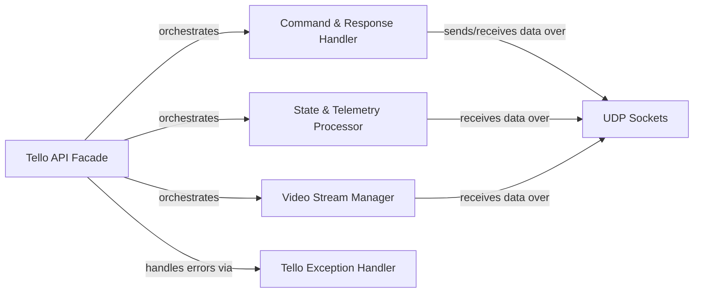

## Details

The `djitellopy` subsystem provides a high-level Python API for controlling DJI Tello drones. Its core is the `Tello API Facade`, which abstracts the complexities of UDP communication, drone state management, and video streaming. This facade orchestrates interactions with internal components responsible for sending commands, receiving and parsing drone telemetry, and managing the video feed. The system is designed with background threads for continuous state and response reception, ensuring a responsive and up-to-date interaction with the drone. Error handling is centralized through a custom exception class.

### Tello API Facade [[Expand]](./Tello_API_Facade.md)
The central component providing a high-level, simplified interface for controlling a single Tello drone. It abstracts complex UDP communication, state parsing, and video stream handling, encapsulating internal mechanisms for command dispatch, state reception, and video processing. It orchestrates interactions with other components.

**Related Classes/Methods**:

- <a href="https://github.com/damiafuentes/DJITelloPy/blob/master/djitellopy/tello.py" target="_blank" rel="noopener noreferrer">`djitellopy.tello.Tello`</a>

### Command & Response Handler
Manages the sending of control commands to the Tello drone and processes the immediate responses received. This includes handling command acknowledgments and ensuring reliable communication.

**Related Classes/Methods**:

- <a href="https://github.com/damiafuentes/DJITelloPy/blob/master/djitellopy/tello.py" target="_blank" rel="noopener noreferrer">`djitellopy.tello.Tello.send_control_command`</a>
- <a href="https://github.com/damiafuentes/DJITelloPy/blob/master/djitellopy/tello.py" target="_blank" rel="noopener noreferrer">`djitellopy.tello.Tello.udp_response_receiver`</a>

### State & Telemetry Processor
Responsible for receiving raw drone state data via UDP, parsing it into a structured format, and providing convenient access to specific telemetry fields (e.g., battery, height, pitch, roll).

**Related Classes/Methods**:

- <a href="https://github.com/damiafuentes/DJITelloPy/blob/master/djitellopy/tello.py" target="_blank" rel="noopener noreferrer">`djitellopy.tello.Tello.udp_state_receiver`</a>
- <a href="https://github.com/damiafuentes/DJITelloPy/blob/master/djitellopy/tello.py" target="_blank" rel="noopener noreferrer">`djitellopy.tello.Tello.parse_state`</a>
- <a href="https://github.com/damiafuentes/DJITelloPy/blob/master/djitellopy/tello.py" target="_blank" rel="noopener noreferrer">`djitellopy.tello.Tello.get_state_field`</a>

### Video Stream Manager
Manages the lifecycle of the video stream from the Tello drone, including starting, stopping, and providing access to video frames. It handles the low-level video data reception and buffering.

**Related Classes/Methods**:

- <a href="https://github.com/damiafuentes/DJITelloPy/blob/master/djitellopy/tello.py" target="_blank" rel="noopener noreferrer">`djitellopy.tello.Tello.change_vs_udp`</a>
- <a href="https://github.com/damiafuentes/DJITelloPy/blob/master/djitellopy/tello.py#L1051-L1129" target="_blank" rel="noopener noreferrer">`djitellopy.tello.BackgroundFrameRead`:1051-1129</a>

### Tello Exception Handler
Defines and manages custom exceptions specific to Tello drone interactions, providing robust error reporting and handling within the API.

**Related Classes/Methods**:

- <a href="https://github.com/damiafuentes/DJITelloPy/blob/master/djitellopy/tello.py#L24-L25" target="_blank" rel="noopener noreferrer">`djitellopy.tello.TelloException`:24-25</a>

### UDP Sockets
Represents the underlying UDP communication mechanism used for interacting with the Tello drone.

**Related Classes/Methods**: _None_

### [FAQ](https://github.com/CodeBoarding/GeneratedOnBoardings/tree/main?tab=readme-ov-file#faq)