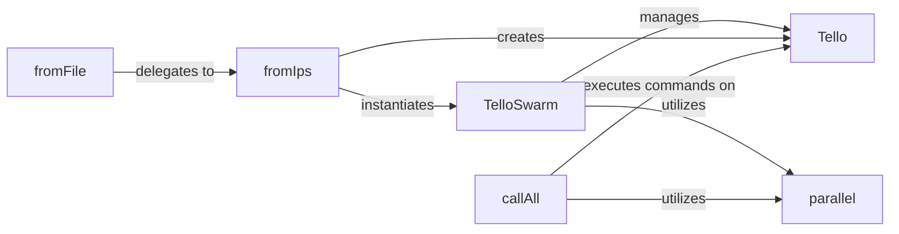

## Details

The DJITelloPy subsystem provides a robust framework for controlling Tello drones, both individually and in a swarm. The Tello component serves as the foundational interface for single-drone operations, encapsulating direct communication and command execution. For managing multiple drones, the TelloSwarm component acts as the central orchestrator, abstracting fleet-wide control. TelloSwarm instances can be conveniently initialized via factory methods such as fromIps, which establishes connections based on provided IP addresses, or fromFile, which streamlines the process by reading IP configurations from a file and delegating to fromIps. The callAll method within TelloSwarm is critical for dispatching commands across the entire drone fleet, efficiently leveraging the parallel utility function to ensure concurrent execution of operations.

### TelloSwarm
The central orchestrator for managing and controlling multiple Tello drones simultaneously. It provides a high-level API for executing commands across the entire fleet, acting as the primary interface for swarm operations.

**Related Classes/Methods**:

- <a href="https://github.com/damiafuentes/DJITelloPy/blob/master/djitellopy/swarm.py#L12-L159" target="_blank" rel="noopener noreferrer">`djitellopy.swarm.TelloSwarm`:12-159</a>

### Tello
Represents an individual Tello drone instance, providing the fundamental API for single-drone operations (e.g., connection, command execution, state retrieval).

**Related Classes/Methods**:

- <a href="https://github.com/damiafuentes/DJITelloPy/blob/master/djitellopy/tello.py" target="_blank" rel="noopener noreferrer">`djitellopy.tello.Tello`</a>

### fromIps
A factory method responsible for initializing a TelloSwarm instance by connecting to multiple Tello drones based on a provided list of IP addresses. It handles the creation of individual Tello instances for each IP.

**Related Classes/Methods**:

- <a href="https://github.com/damiafuentes/DJITelloPy/blob/master/djitellopy/swarm.py#L35-L49" target="_blank" rel="noopener noreferrer">`djitellopy.swarm.fromIps`:35-49</a>

### fromFile
A convenience factory method that simplifies the creation of a TelloSwarm by reading drone IP addresses from a specified file. It delegates the core initialization logic to the fromIps method.

**Related Classes/Methods**:

- <a href="https://github.com/damiafuentes/DJITelloPy/blob/master/djitellopy/swarm.py#L23-L33" target="_blank" rel="noopener noreferrer">`djitellopy.swarm.fromFile`:23-33</a>

### callAll
A method within the TelloSwarm class that dispatches and executes a given function or command on all connected Tello instances managed by the swarm. It is the primary mechanism for performing fleet-wide operations.

**Related Classes/Methods**:

- <a href="https://github.com/damiafuentes/DJITelloPy/blob/master/djitellopy/swarm.py" target="_blank" rel="noopener noreferrer">`djitellopy.swarm.TelloSwarm.callAll`</a>

### parallel
A utility function used by callAll to facilitate the concurrent execution of commands across multiple drones. It ensures that swarm operations can be performed efficiently and in parallel.

**Related Classes/Methods**:

- <a href="https://github.com/damiafuentes/DJITelloPy/blob/master/djitellopy/swarm.py#L91-L107" target="_blank" rel="noopener noreferrer">`djitellopy.swarm.parallel`:91-107</a>

### [FAQ](https://github.com/CodeBoarding/GeneratedOnBoardings/tree/main?tab=readme-ov-file#faq)