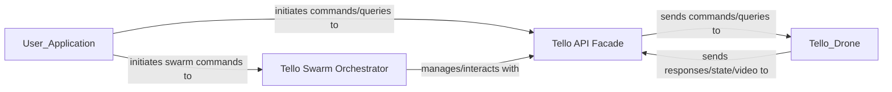

## Details

The DJITelloPy library's architecture is designed around two core internal components: the Tello API Facade and the Tello Swarm Orchestrator. The Tello API Facade (djitellopy.tello.Tello) serves as the primary interface for direct interaction with a single Tello drone, handling all low-level communication protocols, command translation, and data processing (including drone state and video feeds). Building upon this, the Tello Swarm Orchestrator (djitellopy.swarm.TelloSwarm) provides capabilities for managing and coordinating multiple Tello API Facade instances, enabling synchronized control over a fleet of drones. External user applications interact with these components to issue commands and receive data, which are then relayed to and from the physical Tello drones.

### Tello API Facade [[Expand]](./Tello_API_Facade.md)
The central component providing a high-level, simplified interface for controlling a single Tello drone. It abstracts complex UDP communication, state parsing, and video stream handling, encapsulating internal mechanisms for command dispatch, state reception, and video processing.

**Related Classes/Methods**:

- <a href="https://github.com/damiafuentes/DJITelloPy/blob/master/djitellopy/tello.py" target="_blank" rel="noopener noreferrer">`djitellopy.tello.Tello`</a>

### Tello Swarm Orchestrator [[Expand]](./Tello_Swarm_Orchestrator.md)
Offers a higher-level abstraction for controlling multiple Tello drones simultaneously. It manages a collection of Tello API Facade instances to enable synchronized or sequential commands across a fleet of drones.

**Related Classes/Methods**:

- <a href="https://github.com/damiafuentes/DJITelloPy/blob/master/djitellopy/swarm.py#L12-L159" target="_blank" rel="noopener noreferrer">`djitellopy.swarm.TelloSwarm`:12-159</a>

### [FAQ](https://github.com/CodeBoarding/GeneratedOnBoardings/tree/main?tab=readme-ov-file#faq)