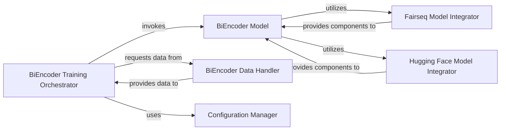

## Details

The Bi-Encoder Module subsystem is defined by its responsibility to encapsulate the Bi-Encoder model architecture and manage its entire training lifecycle, from data loading to checkpointing, for generating dense vector representations of questions and passages.

### BiEncoder Model
Implements the core bi-encoder neural network architecture, responsible for generating dense vector representations of questions and passages, and calculating similarity scores. It acts as the central computational unit for the bi-encoder.

**Related Classes/Methods**:

- <a href="https://github.com/facebookresearch/DPR/blob/main/dpr/models/biencoder.py#L62-L251" target="_blank" rel="noopener noreferrer">`dpr.models.biencoder.BiEncoder`:62-251</a>

### BiEncoder Training Orchestrator
Manages the complete training and validation lifecycle for the BiEncoder Model, including epoch management, loss calculation, validation metrics (NLL, average rank), and checkpointing. It orchestrates the training loop.

**Related Classes/Methods**:

- <a href="https://github.com/facebookresearch/DPR/blob/main/train_dense_encoder.py#L58-L601" target="_blank" rel="noopener noreferrer">`train_dense_encoder.BiEncoderTrainer`:58-601</a>
- <a href="https://github.com/facebookresearch/DPR/blob/main/train_dense_encoder.py#L747-L775" target="_blank" rel="noopener noreferrer">`train_dense_encoder.main`:747-775</a>

### BiEncoder Data Handler
Handles the loading, preprocessing, and provision of data samples specifically formatted for bi-encoder training and evaluation. It ensures data is correctly prepared for the model.

**Related Classes/Methods**:

- <a href="https://github.com/facebookresearch/DPR/blob/main/dpr/data/biencoder_data.py" target="_blank" rel="noopener noreferrer">`dpr.data.biencoder_data`</a>

### Fairseq Model Integrator
Provides utility functions for initializing and integrating Fairseq-based encoder models and their optimizers into the BiEncoder Model.

**Related Classes/Methods**:

- <a href="https://github.com/facebookresearch/DPR/blob/main/dpr/models/fairseq_models.py" target="_blank" rel="noopener noreferrer">`dpr.models.fairseq_models`</a>

### Hugging Face Model Integrator
Provides utility functions for initializing and integrating Hugging Face-based encoder models, tensorizers, and optimizers into the BiEncoder Model.

**Related Classes/Methods**:

- <a href="https://github.com/facebookresearch/DPR/blob/main/dpr/models/hf_models.py" target="_blank" rel="noopener noreferrer">`dpr.models.hf_models`</a>

### Configuration Manager
Manages global configuration parameters, GPU setup, and random seed settings, ensuring consistent and reproducible training and experimentation.

**Related Classes/Methods**:

- <a href="https://github.com/facebookresearch/DPR/blob/main/dpr/options.py" target="_blank" rel="noopener noreferrer">`dpr.options`</a>

### [FAQ](https://github.com/CodeBoarding/GeneratedOnBoardings/tree/main?tab=readme-ov-file#faq)