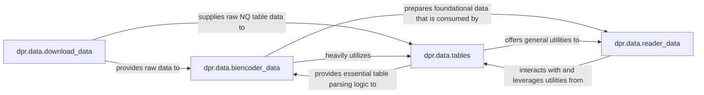

## Details

The `Data Management & Preprocessing` subsystem is responsible for the entire lifecycle of data handling, from raw data acquisition to its transformation into structured datasets suitable for model training and inference within the DPR framework. This aligns with the project's strong data-centric and MLOps architectural bias, ensuring data is prepared efficiently and effectively for the downstream ML pipeline.

### dpr.data.download_data
Acts as the primary data ingestion point, managing the acquisition of raw data resources by downloading and unpacking compressed archives. This component is crucial for setting up the initial dataset for the entire ML pipeline.

**Related Classes/Methods**:

- <a href="https://github.com/facebookresearch/DPR/blob/main/dpr/data/download_data.py" target="_blank" rel="noopener noreferrer">`dpr.data.download_data`</a>

### dpr.data.biencoder_data
Focuses on preparing and managing datasets tailored specifically for the bi-encoder model. This includes loading, parsing structured formats (like NQ tables), and generating bi-encoder-specific data samples suitable for training and inference. It embodies the modularity aspect by preparing data for a specific model type.

**Related Classes/Methods**:

- <a href="https://github.com/facebookresearch/DPR/blob/main/dpr/data/biencoder_data.py" target="_blank" rel="noopener noreferrer">`dpr.data.biencoder_data`</a>

### dpr.data.reader_data
Handles the preprocessing and management of data specifically for the reader model. This involves converting the results from the retriever into a format suitable for reader training and inference, and identifying answer spans within the processed text. This component ensures data is correctly formatted for the second stage of the QA pipeline.

**Related Classes/Methods**:

- <a href="https://github.com/facebookresearch/DPR/blob/main/dpr/data/reader_data.py" target="_blank" rel="noopener noreferrer">`dpr.data.reader_data`</a>

### dpr.data.tables
Serves as a specialized utility component for handling NQ tables. Its functions include parsing table data, converting it into different formats (e.g., CSV for Lucene), and providing robust answer validation mechanisms within table contexts. This component highlights the project's focus on specific data formats and robust data preparation.

**Related Classes/Methods**:

- <a href="https://github.com/facebookresearch/DPR/blob/main/dpr/data/tables.py" target="_blank" rel="noopener noreferrer">`dpr.data.tables`</a>

### [FAQ](https://github.com/CodeBoarding/GeneratedOnBoardings/tree/main?tab=readme-ov-file#faq)