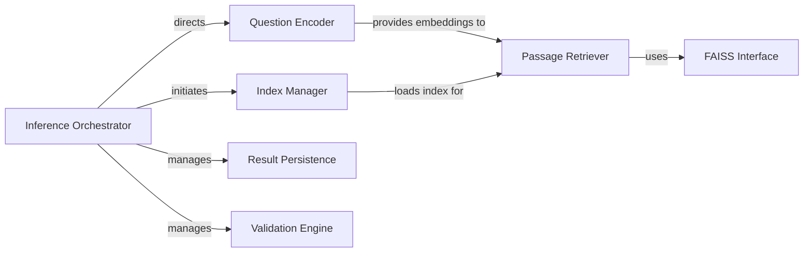

## Details

The Dense Passage Retriever (DPR) system is designed to efficiently retrieve relevant passages given a natural language query. At its core, the system leverages a Bi-Encoder model to transform questions into dense vector embeddings, which are then used to query a pre-built FAISS index containing passage embeddings. The Inference Orchestrator acts as the central coordinator, managing the flow from question encoding to passage retrieval and result handling. The Question Encoder is responsible for generating the query embeddings, while the Passage Retriever interacts with the Index Manager and specific FAISS interfaces to fetch the most relevant documents. Results are then handled by the Result Persistence component, and optionally evaluated by a Validation Engine.

### Inference Orchestrator
The primary entry point and coordinator for the entire dense retrieval inference process. It orchestrates the sequence of operations, including setup, index management, question encoding, passage retrieval, result persistence, and validation.

**Related Classes/Methods**:

- <a href="https://github.com/facebookresearch/DPR/blob/main/dpr/models/biencoder.py#L62-L251" target="_blank" rel="noopener noreferrer">`dpr.models.biencoder.BiEncoder`:62-251</a>

### Question Encoder
Responsible for transforming input questions into dense vector embeddings using the Bi-Encoder model. These embeddings are crucial for querying the FAISS index.

**Related Classes/Methods**:

- <a href="https://github.com/facebookresearch/DPR/blob/main/dpr/models/biencoder.py#L62-L251" target="_blank" rel="noopener noreferrer">`dpr.models.biencoder.BiEncoder`:62-251</a>

### Passage Retriever
Queries the FAISS index using question embeddings to identify and retrieve the most relevant passages (top documents). It abstracts the underlying FAISS interaction.

**Related Classes/Methods**:

- <a href="https://github.com/facebookresearch/DPR/blob/main/dpr/indexer/faiss_indexers.py#L1-L100" target="_blank" rel="noopener noreferrer">`dpr.indexer.faiss_indexers.FaissIndexer`:1-100</a>

### Index Manager
Manages the loading and, if necessary, indexing of the FAISS passage index. Ensures the retrieval system has access to the pre-computed passage embeddings.

**Related Classes/Methods**:

- <a href="https://github.com/facebookresearch/DPR/blob/main/dpr/indexer/faiss_indexers.py#L1-L100" target="_blank" rel="noopener noreferrer">`dpr.indexer.faiss_indexers.FaissIndexer`:1-100</a>

### FAISS Interface
Provides a concrete implementation for interacting with a FAISS index, abstracting whether it's local or remote. This component handles the specifics of index queries.

**Related Classes/Methods**:

- <a href="https://github.com/facebookresearch/DPR/blob/main/dpr/indexer/faiss_indexers.py#L1-L100" target="_blank" rel="noopener noreferrer">`dpr.indexer.faiss_indexers.FaissIndexer`:1-100</a>

### Result Persistence
Handles the saving of the retrieved results (e.g., top passages, scores) to persistent storage, typically for further analysis or downstream processing.

**Related Classes/Methods**:

- <a href="https://github.com/facebookresearch/DPR/blob/main/dpr/data/retriever_data.py#L1-L100" target="_blank" rel="noopener noreferrer">`dpr.data.retriever_data`:1-100</a>

### Validation Engine
Performs validation checks on the retrieved results, potentially comparing them against ground truth or predefined criteria to assess retrieval quality.

**Related Classes/Methods**:

- <a href="https://github.com/facebookresearch/DPR/blob/main/dpr/data/qa_validation.py#L1-L100" target="_blank" rel="noopener noreferrer">`dpr.data.qa_validation`:1-100</a>

### [FAQ](https://github.com/CodeBoarding/GeneratedOnBoardings/tree/main?tab=readme-ov-file#faq)