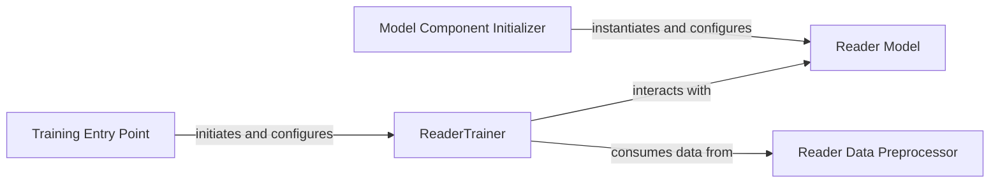

## Details

The `Reader Module` subsystem is a critical part of the DPR project, focusing on the extractive question answering task. Its boundaries are defined by the core neural network architecture for the reader, the training orchestration logic, and the data preparation specific to the reader model.

### Reader Model
Implements the neural network architecture for the extractive reader. It performs the forward pass to generate predictions, computes the training loss based on ground truth, and prepares input tensors from raw data. This component represents the core "Model" aspect of the ML pipeline.

**Related Classes/Methods**:

- <a href="https://github.com/facebookresearch/DPR/blob/main/dpr/models/reader.py#L31-L69" target="_blank" rel="noopener noreferrer">`dpr.models.reader.Reader`:31-69</a>
- <a href="https://github.com/facebookresearch/DPR/blob/main/dpr/models/reader.py" target="_blank" rel="noopener noreferrer">`dpr.models.reader.Reader.forward`</a>
- <a href="https://github.com/facebookresearch/DPR/blob/main/dpr/models/reader.py" target="_blank" rel="noopener noreferrer">`dpr.models.reader.Reader.compute_loss`</a>
- <a href="https://github.com/facebookresearch/DPR/blob/main/dpr/models/reader.py" target="_blank" rel="noopener noreferrer">`dpr.models.reader.Reader.create_reader_input`</a>
- <a href="https://github.com/facebookresearch/DPR/blob/main/dpr/models/reader.py" target="_blank" rel="noopener noreferrer">`dpr.models.reader.Reader._create_question_passages_tensors`</a>

### ReaderTrainer
Orchestrates the entire training and validation lifecycle of the extractive reader. This includes managing training epochs, iterating over data, calculating and backpropagating loss, performing periodic validation, saving model checkpoints, and generating predictions. This component embodies the "Training & Evaluation Framework" pattern.

**Related Classes/Methods**:

- <a href="https://github.com/facebookresearch/DPR/blob/main/train_extractive_reader.py#L63-L536" target="_blank" rel="noopener noreferrer">`train_extractive_reader.ReaderTrainer`:63-536</a>
- <a href="https://github.com/facebookresearch/DPR/blob/main/train_extractive_reader.py" target="_blank" rel="noopener noreferrer">`train_extractive_reader.ReaderTrainer.run_train`</a>
- <a href="https://github.com/facebookresearch/DPR/blob/main/train_extractive_reader.py" target="_blank" rel="noopener noreferrer">`train_extractive_reader.ReaderTrainer._train_epoch`</a>
- <a href="https://github.com/facebookresearch/DPR/blob/main/train_extractive_reader.py" target="_blank" rel="noopener noreferrer">`train_extractive_reader.ReaderTrainer.validate_and_save`</a>
- <a href="https://github.com/facebookresearch/DPR/blob/main/train_extractive_reader.py" target="_blank" rel="noopener noreferrer">`train_extractive_reader.ReaderTrainer.validate`</a>
- <a href="https://github.com/facebookresearch/DPR/blob/main/train_extractive_reader.py" target="_blank" rel="noopener noreferrer">`train_extractive_reader.ReaderTrainer._calc_loss`</a>
- <a href="https://github.com/facebookresearch/DPR/blob/main/train_extractive_reader.py" target="_blank" rel="noopener noreferrer">`train_extractive_reader.ReaderTrainer.get_data_iterator`</a>

### Reader Data Preprocessor
Manages the loading, preprocessing, and transformation of data specifically for the reader model. This involves converting retriever results into reader-specific formats, creating reader samples, and identifying answer spans within passages. This aligns with the "Data Management" aspect of the ML pipeline.

**Related Classes/Methods**:

- <a href="https://github.com/facebookresearch/DPR/blob/main/dpr/data/reader_data.py" target="_blank" rel="noopener noreferrer">`dpr.data.reader_data`</a>
- <a href="https://github.com/facebookresearch/DPR/blob/main/dpr/data/reader_data.py#L234-L317" target="_blank" rel="noopener noreferrer">`dpr.data.reader_data.preprocess_retriever_data`:234-317</a>
- <a href="https://github.com/facebookresearch/DPR/blob/main/dpr/data/reader_data.py#L131-L142" target="_blank" rel="noopener noreferrer">`dpr.data.reader_data.load_data`:131-142</a>
- <a href="https://github.com/facebookresearch/DPR/blob/main/dpr/data/reader_data.py#L144-L191" target="_blank" rel="noopener noreferrer">`dpr.data.reader_data._get_preprocessed_files`:144-191</a>
- <a href="https://github.com/facebookresearch/DPR/blob/main/dpr/data/reader_data.py#L455-L478" target="_blank" rel="noopener noreferrer">`dpr.data.reader_data.find_answer_spans`:455-478</a>
- <a href="https://github.com/facebookresearch/DPR/blob/main/dpr/data/reader_data.py#L170-L182" target="_blank" rel="noopener noreferrer">`dpr.data.reader_data._run_preprocessing`:170-182</a>
- <a href="https://github.com/facebookresearch/DPR/blob/main/dpr/data/reader_data.py#L256-L272" target="_blank" rel="noopener noreferrer">`dpr.data.reader_data.create_reader_sample_ids`:256-272</a>
- <a href="https://github.com/facebookresearch/DPR/blob/main/dpr/data/reader_data.py#L419-L517" target="_blank" rel="noopener noreferrer">`dpr.data.reader_data._select_reader_passages`:419-517</a>

### Model Component Initializer
Handles the initialization of the foundational components for the Reader model, including the underlying BERT/RoBERTa encoder, the tensorizer for input tokenization, and the optimizer for training. This supports the "Configuration Management" and "Utilities" aspects by setting up the model's dependencies.

**Related Classes/Methods**:

- <a href="https://github.com/facebookresearch/DPR/blob/main/dpr/models/hf_models.py" target="_blank" rel="noopener noreferrer">`dpr.models.hf_models`</a>
- <a href="https://github.com/facebookresearch/DPR/blob/main/dpr/models/hf_models.py#L74-L99" target="_blank" rel="noopener noreferrer">`dpr.models.hf_models.get_bert_reader_components`:74-99</a>

### Training Entry Point
Serves as the primary entry point for initiating the reader training process, parsing command-line arguments, and setting up the `ReaderTrainer`. This is the user-facing part of the "Training & Evaluation Framework".

**Related Classes/Methods**:

- <a href="https://github.com/facebookresearch/DPR/blob/main/train_extractive_reader.py#L539-L560" target="_blank" rel="noopener noreferrer">`train_extractive_reader.main`:539-560</a>

### [FAQ](https://github.com/CodeBoarding/GeneratedOnBoardings/tree/main?tab=readme-ov-file#faq)