```mermaid
graph LR
    Data_Management_Preprocessing["Data Management & Preprocessing"]
    Bi_Encoder_Module["Bi-Encoder Module"]
    Reader_Module["Reader Module"]
    FAISS_Index_Management["FAISS Index Management"]
    Dense_Retriever_Inference_Engine["Dense Retriever Inference Engine"]
    Evaluation_Framework["Evaluation Framework"]
    Configuration_System_Utilities["Configuration & System Utilities"]
    Data_Management_Preprocessing -- "Provides Bi-Encoder Training Data" --> Bi_Encoder_Module
    Data_Management_Preprocessing -- "Provides Reader Training Data" --> Reader_Module
    Data_Management_Preprocessing -- "Provides Inference Data" --> Dense_Retriever_Inference_Engine
    Data_Management_Preprocessing -- "Provides Ground Truth Data" --> Evaluation_Framework
    Bi_Encoder_Module -- "Generates Passage Embeddings" --> FAISS_Index_Management
    Bi_Encoder_Module -- "Provides Question Embedding Model" --> Dense_Retriever_Inference_Engine
    Reader_Module -- "Provides Answer Predictions" --> Evaluation_Framework
    Dense_Retriever_Inference_Engine -- "Provides Retrieved Passages" --> Reader_Module
    FAISS_Index_Management -- "Provides FAISS Index" --> Dense_Retriever_Inference_Engine
    Dense_Retriever_Inference_Engine -- "Sends Index Queries" --> FAISS_Index_Management
    Dense_Retriever_Inference_Engine -- "Provides Retrieval Results" --> Evaluation_Framework
    Configuration_System_Utilities -- "Configures Application Settings" --> Data_Management_Preprocessing
    Configuration_System_Utilities -- "Configures Application Settings" --> Bi_Encoder_Module
    Configuration_System_Utilities -- "Configures Application Settings" --> Reader_Module
    Configuration_System_Utilities -- "Configures Application Settings" --> FAISS_Index_Management
    Configuration_System_Utilities -- "Configures Application Settings" --> Dense_Retriever_Inference_Engine
    Configuration_System_Utilities -- "Configures Application Settings" --> Evaluation_Framework
    click Data_Management_Preprocessing href "https://github.com/CodeBoarding/GeneratedOnBoardings/blob/main/DPR/Data_Management_Preprocessing.md" "Details"
    click Bi_Encoder_Module href "https://github.com/CodeBoarding/GeneratedOnBoardings/blob/main/DPR/Bi_Encoder_Module.md" "Details"
    click Reader_Module href "https://github.com/CodeBoarding/GeneratedOnBoardings/blob/main/DPR/Reader_Module.md" "Details"
    click Dense_Retriever_Inference_Engine href "https://github.com/CodeBoarding/GeneratedOnBoardings/blob/main/DPR/Dense_Retriever_Inference_Engine.md" "Details"
    click Configuration_System_Utilities href "https://github.com/CodeBoarding/GeneratedOnBoardings/blob/main/DPR/Configuration_System_Utilities.md" "Details"
```

## Details

The DPR project is structured as a modular Machine Learning pipeline for Open-Domain Question Answering, centered around a bi-encoder architecture. Data flows from Data Management & Preprocessing to feed the training of the Bi-Encoder Module and Reader Module. The Bi-Encoder's output, passage embeddings, are managed by FAISS Index Management to create an efficient search index. During inference, the Dense Retriever Inference Engine leverages the Bi-Encoder and FAISS index to retrieve relevant passages, which are then passed to the Reader for answer extraction. The Evaluation Framework provides crucial feedback on both retrieval and reading performance. All components are configured and supported by the Configuration & System Utilities, enabling flexible experimentation and scalable deployment. This design emphasizes clear component boundaries and data flow, making it ideal for visual representation as a directed graph illustrating the end-to-end Q&A process.

### Data Management & Preprocessing [[Expand]](./Data_Management_Preprocessing.md)
Handles the acquisition, parsing, and transformation of raw data (e.g., NQ tables, passages, QA pairs) into structured datasets suitable for model training and inference. This includes downloading resources and preparing data batches.

**Related Classes/Methods**:

- <a href="https://github.com/facebookresearch/DPR/blob/main/dpr/data/download_data.py" target="_blank" rel="noopener noreferrer">`dpr.data.download_data`</a>
- <a href="https://github.com/facebookresearch/DPR/blob/main/dpr/data/biencoder_data.py" target="_blank" rel="noopener noreferrer">`dpr.data.biencoder_data`</a>
- <a href="https://github.com/facebookresearch/DPR/blob/main/dpr/data/reader_data.py" target="_blank" rel="noopener noreferrer">`dpr.data.reader_data`</a>
- <a href="https://github.com/facebookresearch/DPR/blob/main/dpr/data/tables.py" target="_blank" rel="noopener noreferrer">`dpr.data.tables`</a>

### Bi-Encoder Module [[Expand]](./Bi_Encoder_Module.md)
Encapsulates the Bi-Encoder model architecture and manages its entire training lifecycle, from data loading to checkpointing, for generating dense vector representations of questions and passages.

**Related Classes/Methods**:

- <a href="https://github.com/facebookresearch/DPR/blob/main/dpr/models/biencoder.py" target="_blank" rel="noopener noreferrer">`dpr.models.biencoder`</a>
- <a href="https://github.com/facebookresearch/DPR/blob/main/train_dense_encoder.py" target="_blank" rel="noopener noreferrer">`train_dense_encoder`</a>

### Reader Module [[Expand]](./Reader_Module.md)
Contains the neural network architecture for the extractive reader and orchestrates its training lifecycle, responsible for identifying answer spans within retrieved passages and computing loss.

**Related Classes/Methods**:

- <a href="https://github.com/facebookresearch/DPR/blob/main/dpr/models/reader.py" target="_blank" rel="noopener noreferrer">`dpr.models.reader`</a>
- <a href="https://github.com/facebookresearch/DPR/blob/main/train_extractive_reader.py" target="_blank" rel="noopener noreferrer">`train_extractive_reader`</a>

### FAISS Index Management
Responsible for the creation, population, serialization, and deserialization of FAISS indexes, which are critical for efficient similarity search in passage retrieval.

**Related Classes/Methods**:

- <a href="https://github.com/facebookresearch/DPR/blob/main/dpr/indexer/faiss_indexers.py" target="_blank" rel="noopener noreferrer">`dpr.indexer.faiss_indexers`</a>

### Dense Retriever Inference Engine [[Expand]](./Dense_Retriever_Inference_Engine.md)
Orchestrates the retrieval process during inference. This involves generating question embeddings using the Bi-Encoder, querying the FAISS index for top passages, and handling the overall retrieval logic.

**Related Classes/Methods**:

- <a href="https://github.com/facebookresearch/DPR/blob/main/dense_retriever.py" target="_blank" rel="noopener noreferrer">`dense_retriever`</a>

### Evaluation Framework
Provides functionalities for evaluating the performance of both Retriever and Reader models against ground truth answers, including answer checking and metric calculation.

**Related Classes/Methods**:

- <a href="https://github.com/facebookresearch/DPR/blob/main/dpr/data/qa_validation.py" target="_blank" rel="noopener noreferrer">`dpr.data.qa_validation`</a>

### Configuration & System Utilities [[Expand]](./Configuration_System_Utilities.md)
Centralized management for application configuration (using Hydra) and common utility functions, including GPU setup and distributed training utilities, supporting all other components.

**Related Classes/Methods**:

- <a href="https://github.com/facebookresearch/DPR/blob/main/dpr/options.py" target="_blank" rel="noopener noreferrer">`dpr.options`</a>
- <a href="https://github.com/facebookresearch/DPR/blob/main/dpr/utils/dist_utils.py" target="_blank" rel="noopener noreferrer">`dpr.utils.dist_utils`</a>

### [FAQ](https://github.com/CodeBoarding/GeneratedOnBoardings/tree/main?tab=readme-ov-file#faq)