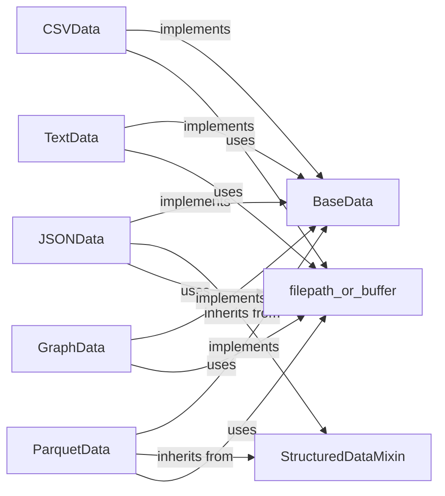

## Details

The `Data Ingestion & Preprocessing` subsystem is a critical part of the DataProfiler project, responsible for standardizing diverse raw data into a structured format for subsequent analysis.

### BaseData
Serves as the abstract base class, establishing a standardized interface (`data()`, `get_batch_generator()`, `reload()`) for all concrete data readers. It ensures a consistent output contract for the initial stage of the data processing pipeline. Embodies the 'Pipeline/Workflow' pattern by defining the entry point and common interface for data ingestion.

**Related Classes/Methods**:

- <a href="https://github.com/capitalone/DataProfiler/blob/main/dataprofiler/data_readers/base_data.py#L17-L245" target="_blank" rel="noopener noreferrer">`BaseData`:17-245</a>

### CSVData
Concrete implementation of `BaseData`, specializing in reading, parsing, and performing initial preprocessing for CSV data. Handles format-specific complexities like delimiter detection. Aligns with the 'Extensible Architecture' and 'Modular Architecture'.

**Related Classes/Methods**:

- <a href="https://github.com/capitalone/DataProfiler/blob/main/dataprofiler/data_readers/csv_data.py#L20-L770" target="_blank" rel="noopener noreferrer">`CSVData`:20-770</a>

### JSONData
Concrete implementation of `BaseData`, specializing in reading, parsing, and performing initial preprocessing for JSON data. Handles format-specific complexities like flattening nested structures. Aligns with the 'Extensible Architecture' and 'Modular Architecture'.

**Related Classes/Methods**:

- <a href="https://github.com/capitalone/DataProfiler/blob/main/dataprofiler/data_readers/json_data.py#L19-L446" target="_blank" rel="noopener noreferrer">`JSONData`:19-446</a>

### ParquetData
Concrete implementation of `BaseData`, specializing in reading, parsing, and performing initial preprocessing for Parquet data. Aligns with the 'Extensible Architecture' and 'Modular Architecture'.

**Related Classes/Methods**:

- <a href="https://github.com/capitalone/DataProfiler/blob/main/dataprofiler/data_readers/parquet_data.py#L13-L184" target="_blank" rel="noopener noreferrer">`ParquetData`:13-184</a>

### TextData
Concrete implementation of `BaseData`, specializing in reading, parsing, and performing initial preprocessing for plain text data. Aligns with the 'Extensible Architecture' and 'Modular Architecture'.

**Related Classes/Methods**:

- <a href="https://github.com/capitalone/DataProfiler/blob/main/dataprofiler/data_readers/text_data.py#L10-L148" target="_blank" rel="noopener noreferrer">`TextData`:10-148</a>

### GraphData
Concrete implementation of `BaseData`, specializing in reading, parsing, and performing initial preprocessing for graph data. Aligns with the 'Extensible Architecture' and 'Modular Architecture'.

**Related Classes/Methods**:

- <a href="https://github.com/capitalone/DataProfiler/blob/main/dataprofiler/data_readers/graph_data.py#L13-L308" target="_blank" rel="noopener noreferrer">`GraphData`:13-308</a>

### StructuredDataMixin
Provides reusable logic and common functionalities for structured data readers (e.g., CSV, JSON, Parquet). Promotes code reuse and consistency across similar data types. Reinforces the 'Modular Architecture' by abstracting common functionalities into a reusable mixin.

**Related Classes/Methods**:

- <a href="https://github.com/capitalone/DataProfiler/blob/main/dataprofiler/data_readers/data_utils.py" target="_blank" rel="noopener noreferrer">`StructuredDataMixin`</a>

### filepath_or_buffer
A context manager that abstracts and standardizes the handling of diverse data sources, whether they are file paths or in-memory buffers. It ensures uniform input handling for all data readers. Contributes to the 'Modular Architecture' and 'Pipeline/Workflow' by providing a consistent mechanism for input data access.

**Related Classes/Methods**:

- <a href="https://github.com/capitalone/DataProfiler/blob/main/dataprofiler/data_readers/filepath_or_buffer.py" target="_blank" rel="noopener noreferrer">`filepath_or_buffer`</a>

### [FAQ](https://github.com/CodeBoarding/GeneratedOnBoardings/tree/main?tab=readme-ov-file#faq)