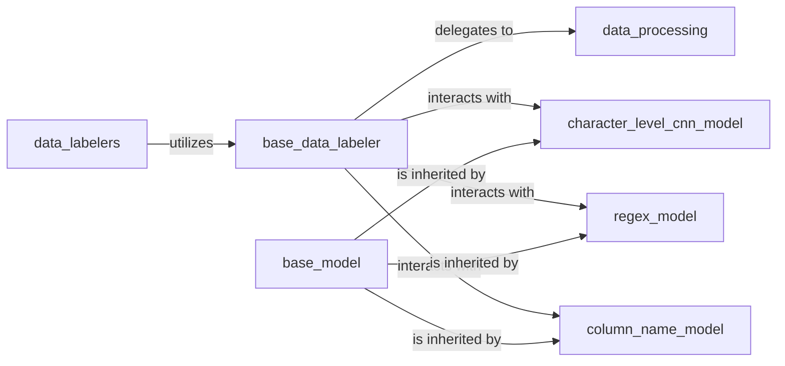

## Details

The `Data Labeling Module` subsystem is responsible for the end-to-end process of identifying and classifying sensitive or specific data elements. It orchestrates data preparation, model execution (deep learning, regex, column name), and result processing.

### base_data_labeler
Acts as the primary entry point and orchestrator for the entire data labeling pipeline. It manages the lifecycle of data labelers, including loading, saving, parameter validation, and coordinating pre-processing, model execution, and post-processing steps.

**Related Classes/Methods**:

- <a href="https://github.com/capitalone/DataProfiler/blob/main/dataprofiler/labelers/base_data_labeler.py#L23-L757" target="_blank" rel="noopener noreferrer">`dataprofiler.labelers.base_data_labeler.BaseDataLabeler`:23-757</a>

### base_model
Serves as the abstract base class for all data labeling models. It provides common functionalities such as managing label mappings, validating parameters, and registering subclasses, ensuring a consistent interface for various model implementations.

**Related Classes/Methods**:

- <a href="https://github.com/capitalone/DataProfiler/blob/main/dataprofiler/labelers/base_model.py#L32-L366" target="_blank" rel="noopener noreferrer">`dataprofiler.labelers.base_model.BaseModel`:32-366</a>

### character_level_cnn_model
Implements a deep learning model (Character-Level CNN) for data labeling. It handles the construction, training, and prediction using character embeddings, specializing in complex pattern recognition.

**Related Classes/Methods**:

- <a href="https://github.com/capitalone/DataProfiler/blob/main/dataprofiler/labelers/character_level_cnn_model.py#L204-L918" target="_blank" rel="noopener noreferrer">`dataprofiler.labelers.character_level_cnn_model.CharacterLevelCnnModel`:204-918</a>

### regex_model
Provides a rule-based data labeling mechanism using regular expressions. Its primary function is to validate its configuration parameters and apply regex patterns for classification.

**Related Classes/Methods**:

- <a href="https://github.com/capitalone/DataProfiler/blob/main/dataprofiler/labelers/regex_model.py#L20-L306" target="_blank" rel="noopener noreferrer">`dataprofiler.labelers.regex_model.RegexModel`:20-306</a>

### column_name_model
Implements a data labeling model that leverages column names for classification. It performs comparisons and predictions based on column name patterns, useful for structured data.

**Related Classes/Methods**:

- <a href="https://github.com/capitalone/DataProfiler/blob/main/dataprofiler/labelers/column_name_model.py#L27-L316" target="_blank" rel="noopener noreferrer">`dataprofiler.labelers.column_name_model.ColumnNameModel`:27-316</a>

### data_processing
Functions as a versatile preprocessor and postprocessor for the data labeling pipeline. It handles data transformations, format conversions (e.g., to NER format, structured/unstructured), and prediction result processing.

**Related Classes/Methods**:

- <a href="https://github.com/capitalone/DataProfiler/blob/main/dataprofiler/labelers/data_processing.py#L1-L100" target="_blank" rel="noopener noreferrer">`dataprofiler.labelers.data_processing.DataProcessing`:1-100</a>

### data_labelers
Provides a higher-level facade or utility for initiating labeling processes, abstracting the direct instantiation and utilization of `base_data_labeler`.

**Related Classes/Methods**:

- <a href="https://github.com/capitalone/DataProfiler/blob/main/dataprofiler/labelers/data_labelers.py#L1-L100" target="_blank" rel="noopener noreferrer">`dataprofiler.labelers.data_labelers.DataLabelers`:1-100</a>

### [FAQ](https://github.com/CodeBoarding/GeneratedOnBoardings/tree/main?tab=readme-ov-file#faq)