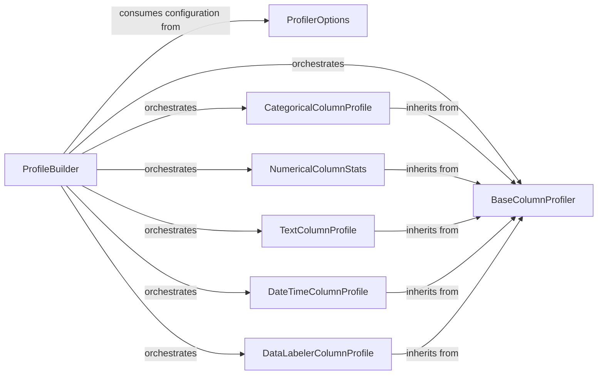

## Details

The core of the `dataprofiler`'s profiling subsystem revolves around the `ProfileBuilder` which orchestrates the profiling process. It dynamically utilizes various specialized `ColumnProfiler` implementations, all of which adhere to the `BaseColumnProfiler` abstract interface. This design promotes extensibility, allowing new column types to be profiled by simply implementing the `BaseColumnProfiler` interface. The `ProfilerOptions` component provides crucial configuration, enabling fine-grained control over which statistics and profilers are active, thereby influencing the depth and breadth of the profiling output.

The `dataprofiler`'s profiling subsystem is built around an extensible architecture centered on the `ProfileBuilder`. This component acts as the central coordinator, responsible for initiating and managing various `ColumnProfiler` instances. Each `ColumnProfiler` specializes in analyzing a particular data type (e.g., categorical, numerical, text, datetime) and adheres to the common interface defined by the `BaseColumnProfiler` abstract class. This adherence enables `ProfileBuilder` to interact uniformly with diverse profiler types. The entire profiling process is configurable via `ProfilerOptions`, which allows users to precisely control the enabled profilers and the statistics to be computed, ensuring a flexible and adaptable data profiling solution.

### ProfileBuilder
The primary orchestrator of the data profiling process. It initializes and manages instances of various `ColumnProfiler` types, dispatches data chunks to them, aggregates results, and handles profile merging and serialization/deserialization. It acts as the central control point for the profiling pipeline.

**Related Classes/Methods**:

- <a href="https://github.com/capitalone/DataProfiler/blob/main/dataprofiler/profilers/profile_builder.py" target="_blank" rel="noopener noreferrer">`dataprofiler.profilers.profile_builder.ProfileBuilder`</a>

### BaseColumnProfiler
The abstract base class for all specialized column profilers. It defines a common interface (`update`, `diff`, `merge`, `profile`) and shared functionalities, ensuring consistency and enabling the "Extensible Architecture" pattern for adding new profiler types.

**Related Classes/Methods**:

- <a href="https://github.com/capitalone/DataProfiler/blob/main/dataprofiler/profilers/base_column_profilers.py#L20-L287" target="_blank" rel="noopener noreferrer">`dataprofiler.profilers.base_column_profilers.BaseColumnProfiler`:20-287</a>

### ProfilerOptions
Manages and validates configuration settings for the entire profiling process. It allows users to enable/disable specific statistics or profilers, providing fine-grained control over the profiling output.

**Related Classes/Methods**:

- <a href="https://github.com/capitalone/DataProfiler/blob/main/dataprofiler/profilers/profiler_options.py#L1684-L1829" target="_blank" rel="noopener noreferrer">`dataprofiler.profilers.profiler_options.ProfilerOptions`:1684-1829</a>

### CategoricalColumnProfile
A specialized profiler designed for categorical data. It calculates statistics such as unique value counts, frequency distributions, and identifies common categories, providing insights relevant to discrete data types.

**Related Classes/Methods**:

- <a href="https://github.com/capitalone/DataProfiler/blob/main/dataprofiler/profilers/categorical_column_profile.py" target="_blank" rel="noopener noreferrer">`dataprofiler.profilers.categorical_column_profile.CategoricalColumnProfile`</a>

### NumericalColumnStats
A specialized profiler for numerical data. It computes essential statistics like mean, median, standard deviation, min, max, and quantiles, offering a comprehensive view of numerical distributions.

**Related Classes/Methods**:

- <a href="https://github.com/capitalone/DataProfiler/blob/main/dataprofiler/profilers/numerical_column_stats.py" target="_blank" rel="noopener noreferrer">`dataprofiler.profilers.numerical_column_stats.NumericalColumnStats`</a>

### TextColumnProfile
A specialized profiler for general text data. It extracts statistics such as character set distribution, common patterns, and text length distributions, useful for understanding the structure and content of text fields.

**Related Classes/Methods**:

- <a href="https://github.com/capitalone/DataProfiler/blob/main/dataprofiler/profilers/text_column_profile.py" target="_blank" rel="noopener noreferrer">`dataprofiler.profilers.text_column_profile.TextColumnProfile`</a>

### DateTimeColumnProfile
A specialized profiler for datetime data. It identifies date formats, calculates time ranges, and extracts temporal statistics like earliest/latest dates, aiding in the analysis of time-series or event data.

**Related Classes/Methods**:

- <a href="https://github.com/capitalone/DataProfiler/blob/main/dataprofiler/profilers/datetime_column_profile.py" target="_blank" rel="noopener noreferrer">`dataprofiler.profilers.datetime_column_profile.DateTimeColumnProfile`</a>

### DataLabelerColumnProfile
A specialized profiler that leverages external data labeling capabilities to predict and categorize data types within a column. It integrates with the `DataLabelersPackage` to enhance profiling with semantic labels.

**Related Classes/Methods**:

- <a href="https://github.com/capitalone/DataProfiler/blob/main/dataprofiler/profilers/data_labeler_column_profile.py" target="_blank" rel="noopener noreferrer">`dataprofiler.profilers.data_labeler_column_profile.DataLabelerColumnProfile`</a>

### [FAQ](https://github.com/CodeBoarding/GeneratedOnBoardings/tree/main?tab=readme-ov-file#faq)