```mermaid
graph LR
    Data_Ingestion_Preprocessing["Data Ingestion & Preprocessing"]
    Data_Labeling_Module["Data Labeling Module"]
    Data_Profiling_Engine["Data Profiling Engine"]
    Reporting_Visualization["Reporting & Visualization"]
    Data_Ingestion_Preprocessing -- "Provides Raw Data" --> Data_Labeling_Module
    Data_Ingestion_Preprocessing -- "Feeds Preprocessed Data" --> Data_Profiling_Engine
    Data_Labeling_Module -- "Enriches Profiled Data" --> Data_Profiling_Engine
    Data_Profiling_Engine -- "Outputs Profiled Results" --> Reporting_Visualization
    click Data_Ingestion_Preprocessing href "https://github.com/CodeBoarding/GeneratedOnBoardings/blob/main/DataProfiler/Data_Ingestion_Preprocessing.md" "Details"
    click Data_Labeling_Module href "https://github.com/CodeBoarding/GeneratedOnBoardings/blob/main/DataProfiler/Data_Labeling_Module.md" "Details"
    click Data_Profiling_Engine href "https://github.com/CodeBoarding/GeneratedOnBoardings/blob/main/DataProfiler/Data_Profiling_Engine.md" "Details"
```

## Details

The DataProfiler project is architected as a robust data processing pipeline, designed to ingest, label, profile, and report on diverse datasets. At its core, the Data Ingestion & Preprocessing component acts as the entry point, standardizing raw data from various formats. This prepared data then concurrently feeds into the Data Labeling Module for sensitive information detection and the central Data Profiling Engine for comprehensive statistical analysis. The Data Labeling Module's output further enriches the profiling process within the Data Profiling Engine. Finally, the detailed insights generated by the Data Profiling Engine are channeled to the Reporting & Visualization component, which renders user-friendly reports and visual summaries. This clear, sequential flow with distinct component boundaries makes the DataProfiler highly suitable for visual diagram representation, highlighting the progression of data through analysis and reporting stages.

### Data Ingestion & Preprocessing [[Expand]](./Data_Ingestion_Preprocessing.md)
Responsible for reading raw data from diverse sources (CSV, JSON, Parquet, Text, Graph) and transforming it into a standardized, structured format (e.g., Pandas DataFrame) suitable for subsequent profiling and labeling.

**Related Classes/Methods**:

- <a href="https://github.com/capitalone/DataProfiler/blob/main/dataprofiler/data_readers/base_data.py" target="_blank" rel="noopener noreferrer">`dataprofiler/data_readers/base_data.py`</a>
- <a href="https://github.com/capitalone/DataProfiler/blob/main/dataprofiler/data_readers/csv_data.py" target="_blank" rel="noopener noreferrer">`dataprofiler/data_readers/csv_data.py`</a>
- <a href="https://github.com/capitalone/DataProfiler/blob/main/dataprofiler/data_readers/json_data.py" target="_blank" rel="noopener noreferrer">`dataprofiler/data_readers/json_data.py`</a>
- <a href="https://github.com/capitalone/DataProfiler/blob/main/dataprofiler/data_readers/parquet_data.py" target="_blank" rel="noopener noreferrer">`dataprofiler/data_readers/parquet_data.py`</a>
- <a href="https://github.com/capitalone/DataProfiler/blob/main/dataprofiler/data_readers/text_data.py" target="_blank" rel="noopener noreferrer">`dataprofiler/data_readers/text_data.py`</a>
- <a href="https://github.com/capitalone/DataProfiler/blob/main/dataprofiler/data_readers/graph_data.py" target="_blank" rel="noopener noreferrer">`dataprofiler/data_readers/graph_data.py`</a>

### Data Labeling Module [[Expand]](./Data_Labeling_Module.md)
Manages the end-to-end process of identifying and classifying sensitive or specific data elements. It orchestrates data preparation, model execution (deep learning, regex, column name), and result processing.

**Related Classes/Methods**:

- <a href="https://github.com/capitalone/DataProfiler/blob/main/dataprofiler/labelers/base_data_labeler.py" target="_blank" rel="noopener noreferrer">`dataprofiler/labelers/base_data_labeler.py`</a>
- <a href="https://github.com/capitalone/DataProfiler/blob/main/dataprofiler/labelers/character_level_cnn_model.py" target="_blank" rel="noopener noreferrer">`dataprofiler/labelers/character_level_cnn_model.py`</a>
- <a href="https://github.com/capitalone/DataProfiler/blob/main/dataprofiler/labelers/regex_model.py" target="_blank" rel="noopener noreferrer">`dataprofiler/labelers/regex_model.py`</a>
- <a href="https://github.com/capitalone/DataProfiler/blob/main/dataprofiler/labelers/column_name_model.py" target="_blank" rel="noopener noreferrer">`dataprofiler/labelers/column_name_model.py`</a>
- <a href="https://github.com/capitalone/DataProfiler/blob/main/dataprofiler/labelers/data_processing.py" target="_blank" rel="noopener noreferrer">`dataprofiler/labelers/data_processing.py`</a>

### Data Profiling Engine [[Expand]](./Data_Profiling_Engine.md)
The central orchestrator for data profiling. It coordinates with specialized column profilers to extract various statistics and insights, applying user-defined configurations to generate comprehensive data profiles. This component internally manages different column-specific profilers and profiling options.

**Related Classes/Methods**:

- <a href="https://github.com/capitalone/DataProfiler/blob/main/dataprofiler/profilers/profile_builder.py" target="_blank" rel="noopener noreferrer">`dataprofiler/profilers/profile_builder.py`</a>
- <a href="https://github.com/capitalone/DataProfiler/blob/main/dataprofiler/profilers/categorical_column_profile.py" target="_blank" rel="noopener noreferrer">`dataprofiler/profilers/categorical_column_profile.py`</a>
- <a href="https://github.com/capitalone/DataProfiler/blob/main/dataprofiler/profilers/data_labeler_column_profile.py" target="_blank" rel="noopener noreferrer">`dataprofiler/profilers/data_labeler_column_profile.py`</a>
- <a href="https://github.com/capitalone/DataProfiler/blob/main/dataprofiler/profilers/numerical_column_stats.py" target="_blank" rel="noopener noreferrer">`dataprofiler/profilers/numerical_column_stats.py`</a>
- <a href="https://github.com/capitalone/DataProfiler/blob/main/dataprofiler/profilers/text_column_profile.py" target="_blank" rel="noopener noreferrer">`dataprofiler/profilers/text_column_profile.py`</a>
- <a href="https://github.com/capitalone/DataProfiler/blob/main/dataprofiler/profilers/unstructured_text_profile.py" target="_blank" rel="noopener noreferrer">`dataprofiler/profilers/unstructured_text_profile.py`</a>
- <a href="https://github.com/capitalone/DataProfiler/blob/main/dataprofiler/profilers/graph_profiler.py" target="_blank" rel="noopener noreferrer">`dataprofiler/profilers/graph_profiler.py`</a>
- <a href="https://github.com/capitalone/DataProfiler/blob/main/dataprofiler/profilers/datetime_column_profile.py" target="_blank" rel="noopener noreferrer">`dataprofiler/profilers/datetime_column_profile.py`</a>
- <a href="https://github.com/capitalone/DataProfiler/blob/main/dataprofiler/profilers/float_column_profile.py" target="_blank" rel="noopener noreferrer">`dataprofiler/profilers/float_column_profile.py`</a>
- <a href="https://github.com/capitalone/DataProfiler/blob/main/dataprofiler/profilers/int_column_profile.py" target="_blank" rel="noopener noreferrer">`dataprofiler/profilers/int_column_profile.py`</a>
- <a href="https://github.com/capitalone/DataProfiler/blob/main/dataprofiler/profilers/profiler_options.py" target="_blank" rel="noopener noreferrer">`dataprofiler/profilers/profiler_options.py`</a>

### Reporting & Visualization
Generates human-readable reports and visual representations (e.g., histograms, missing value matrices) from the collected data profiles, enabling effective interpretation of results.

**Related Classes/Methods**:

- <a href="https://github.com/capitalone/DataProfiler/blob/main/dataprofiler/reports/graphs.py" target="_blank" rel="noopener noreferrer">`dataprofiler/reports/graphs.py`</a>

### [FAQ](https://github.com/CodeBoarding/GeneratedOnBoardings/tree/main?tab=readme-ov-file#faq)