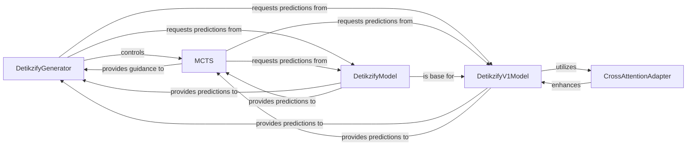

## Details

The DeTikZify Inference Core is the central intelligence component responsible for understanding user input, leveraging the generative AI model, and employing Monte Carlo Tree Search to produce optimal TikZ code.

### DetikzifyGenerator
The primary orchestrator of the TikZ code generation process. It manages the inference loop, including token sampling, MCTS-guided simulation, and decoding of generated tokens into TikZ code. This component embodies the "Inference Engine" aspect.

**Related Classes/Methods**:

- <a href="https://github.com/potamides/DeTikZify/blob/main/detikzify/infer/generate.py#L145-L353" target="_blank" rel="noopener noreferrer">`detikzify.infer.generate.DetikzifyGenerator`:145-353</a>

### MCTS
Implements the Monte Carlo Tree Search algorithm, crucial for intelligently exploring the vast search space of possible TikZ code sequences. It optimizes the generation process by simulating potential outcomes and expanding the search tree, representing the "Search/Refinement Algorithm" pattern.

**Related Classes/Methods**:

- <a href="https://github.com/potamides/DeTikZify/blob/main/detikzify/mcts/montecarlo.py" target="_blank" rel="noopener noreferrer">`detikzify.mcts.montecarlo.MCTS`</a>

### DetikzifyModel
Defines the foundational architecture and forward pass logic for the base generative AI model. It integrates various sub-components necessary for processing input and generating output tokens, forming a core part of the "Model Core".

**Related Classes/Methods**:

- <a href="https://github.com/potamides/DeTikZify/blob/main/detikzify/model/modeling_detikzify.py#L119-L271" target="_blank" rel="noopener noreferrer">`detikzify.model.modeling_detikzify.DetikzifyModel`:119-271</a>

### DetikzifyV1Model
A specialized version of the generative model, designed to incorporate vision capabilities. It handles the extraction and processing of visual features, extending the base model's functionality to multimodal inputs. This represents a specific "Model Core" variant, aligning with the project's multimodal nature.

**Related Classes/Methods**:

- <a href="https://github.com/potamides/DeTikZify/blob/main/detikzify/model/v1/modeling_detikzify.py" target="_blank" rel="noopener noreferrer">`detikzify.model.v1.modeling_detikzify.DetikzifyV1Model`</a>

### CrossAttentionAdapter
Manages the adaptation of the core generative model, primarily through cross-attention layers. This allows for flexible integration of different modalities or fine-tuning, enhancing the model's ability to process diverse inputs and generate contextually relevant outputs. This component supports the "Modular Architecture" and "Model Adaptation" aspects.

**Related Classes/Methods**:

- <a href="https://github.com/potamides/DeTikZify/blob/main/detikzify/model/adapter/modeling_adapter.py#L355-L394" target="_blank" rel="noopener noreferrer">`detikzify.model.adapter.modeling_adapter.CrossAttentionAdapter`:355-394</a>

### [FAQ](https://github.com/CodeBoarding/GeneratedOnBoardings/tree/main?tab=readme-ov-file#faq)