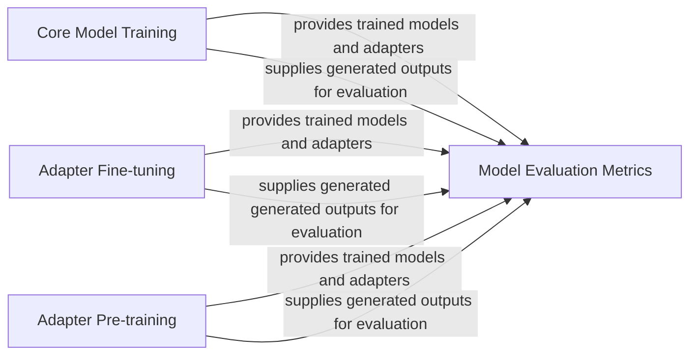

## Details

The DeTikZify project's training and evaluation subsystem is structured around distinct components for model development. The Core Model Training component handles the primary training of the generative model. Adapter Pre-training focuses on establishing foundational knowledge for adapters through self-supervised or knowledge distillation techniques, while Adapter Fine-tuning refines these adapters for specific tasks. All training components (Core Model Training, Adapter Fine-tuning, and Adapter Pre-training) contribute trained models and generated outputs to the Model Evaluation Metrics component, which is responsible for assessing model performance using a suite of specialized metrics. This modular design allows for independent development and evaluation of core models and their specialized adapters.

### Core Model Training
Orchestrates the primary training loop for the core DeTikZify generative model. This involves managing the training process, including data loading (e.g., ImageSketchDataset) and tokenization.

**Related Classes/Methods**:

- <a href="https://github.com/potamides/DeTikZify/blob/main/detikzify/train/train.py" target="_blank" rel="noopener noreferrer">`detikzify/train/train.py`</a>

### Adapter Fine-tuning
Manages the fine-tuning or training of specific model adapters. These adapters are crucial for adapting large generative models to specific tasks or datasets, utilizing components like AdapterDataset for data handling.

**Related Classes/Methods**:

- <a href="https://github.com/potamides/DeTikZify/blob/main/detikzify/train/adapter/train.py" target="_blank" rel="noopener noreferrer">`detikzify/train/adapter/train.py`</a>

### Adapter Pre-training
Manages the pre-training process for model adapters, focusing on learning robust representations. This involves using techniques like knowledge distillation or self-supervised learning with augmented image data, facilitated by AdapterDataset and AdapterTrainer.

**Related Classes/Methods**:

- <a href="https://github.com/potamides/DeTikZify/blob/main/detikzify/train/adapter/pretrain.py" target="_blank" rel="noopener noreferrer">`detikzify/train/adapter/pretrain.py`</a>

### Model Evaluation Metrics
A collection of modules responsible for computing various metrics to assess the quality, similarity, and perceptual characteristics of generated outputs (both images and text). This includes metrics like CLIPScore, DreamSim, Edit Distance (EED), CrystalBLEU, Kernel Inception Distance (KID), and general image similarity.

**Related Classes/Methods**:

- <a href="https://github.com/potamides/DeTikZify/blob/main/detikzify/evaluate/clipscore.py" target="_blank" rel="noopener noreferrer">`detikzify/evaluate/clipscore.py`</a>
- <a href="https://github.com/potamides/DeTikZify/blob/main/detikzify/evaluate/dreamsim.py" target="_blank" rel="noopener noreferrer">`detikzify/evaluate/dreamsim.py`</a>
- <a href="https://github.com/potamides/DeTikZify/blob/main/detikzify/evaluate/eed.py" target="_blank" rel="noopener noreferrer">`detikzify/evaluate/eed.py`</a>
- <a href="https://github.com/potamides/DeTikZify/blob/main/detikzify/evaluate/crystalbleu.py" target="_blank" rel="noopener noreferrer">`detikzify/evaluate/crystalbleu.py`</a>
- <a href="https://github.com/potamides/DeTikZify/blob/main/detikzify/evaluate/kid.py" target="_blank" rel="noopener noreferrer">`detikzify/evaluate/kid.py`</a>
- <a href="https://github.com/potamides/DeTikZify/blob/main/detikzify/evaluate/imagesim.py" target="_blank" rel="noopener noreferrer">`detikzify/evaluate/imagesim.py`</a>

### [FAQ](https://github.com/CodeBoarding/GeneratedOnBoardings/tree/main?tab=readme-ov-file#faq)