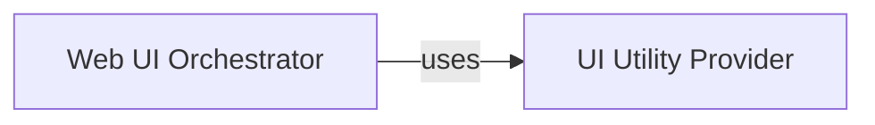

## Details

The `Web User Interface` subsystem provides the primary means for users to interact with the DeTikZify system. It is responsible for handling user input, initiating the core model's inference process, and presenting the generated outputs.

### Web UI Orchestrator
This component acts as the central control point for the web user interface. It manages the primary user interaction flows, specifically orchestrating the inference process. This includes handling user inputs, initiating calls to the core model for operations like sampling and simulation, and preparing the results for display to the user. It embodies the core logic of the UI's interaction with the backend.

**Related Classes/Methods**:

- <a href="https://github.com/potamides/DeTikZify/blob/main/detikzify/webui/webui.py" target="_blank" rel="noopener noreferrer">`detikzify.webui.webui:inference`</a>
- <a href="https://github.com/potamides/DeTikZify/blob/main/detikzify/webui/webui.py" target="_blank" rel="noopener noreferrer">`detikzify.webui.webui:sample`</a>
- <a href="https://github.com/potamides/DeTikZify/blob/main/detikzify/webui/webui.py" target="_blank" rel="noopener noreferrer">`detikzify.webui.webui:simulate`</a>

### UI Utility Provider
This component provides a suite of auxiliary functions that support various aspects of the web user interface. Its responsibilities include essential data transformations (e.g., converting data to SVG format for rendering), image handling (e.g., generating unique identifiers for images), and dynamic content generation. These utilities ensure efficient, consistent, and correct rendering of UI elements and data.

**Related Classes/Methods**:

- <a href="https://github.com/potamides/DeTikZify/blob/main/detikzify/webui/helpers.py" target="_blank" rel="noopener noreferrer">`detikzify.webui.helpers:add`</a>
- <a href="https://github.com/potamides/DeTikZify/blob/main/detikzify/webui/helpers.py" target="_blank" rel="noopener noreferrer">`detikzify.webui.helpers:to_svg`</a>
- <a href="https://github.com/potamides/DeTikZify/blob/main/detikzify/webui/helpers.py" target="_blank" rel="noopener noreferrer">`detikzify.webui.helpers:images`</a>
- <a href="https://github.com/potamides/DeTikZify/blob/main/detikzify/webui/helpers.py" target="_blank" rel="noopener noreferrer">`detikzify.webui.helpers:make_ordinal`</a>
- <a href="https://github.com/potamides/DeTikZify/blob/main/detikzify/webui/helpers.py" target="_blank" rel="noopener noreferrer">`detikzify.webui.helpers:__call__`</a>
- <a href="https://github.com/potamides/DeTikZify/blob/main/detikzify/webui/helpers.py" target="_blank" rel="noopener noreferrer">`detikzify.webui.helpers:generate`</a>

### [FAQ](https://github.com/CodeBoarding/GeneratedOnBoardings/tree/main?tab=readme-ov-file#faq)