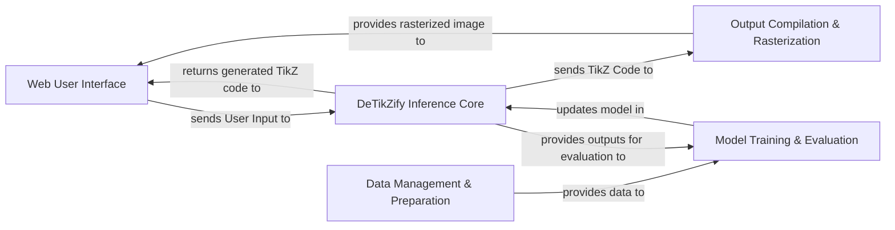

## Details

The DeTikZify project employs a modular architecture centered around its `DeTikZify Inference Core`, which leverages generative AI and Monte Carlo Tree Search to convert user input into TikZ code. User interaction is managed by the `Web User Interface`, which sends requests to the inference core and displays the final rasterized outputs. The generated TikZ code is then processed by the `Output Compilation & Rasterization` component, responsible for compiling the code into visual formats by interacting with external rendering services. Supporting this core functionality are the `Data Management & Preparation` component, which handles dataset loading and preprocessing, and the `Model Training & Evaluation` component, overseeing the entire model development lifecycle, including training, optimization, and performance evaluation. This clear separation of concerns facilitates maintainability, scalability, and independent development of each functional block.

### Web User Interface [[Expand]](./Web_User_Interface.md)
The primary interface for users to interact with the DeTikZify system, submit inputs, and view generated outputs.

**Related Classes/Methods**:

- <a href="https://github.com/potamides/DeTikZify/blob/main/detikzify/webui/webui.py" target="_blank" rel="noopener noreferrer">`detikzify.webui.webui`</a>
- <a href="https://github.com/potamides/DeTikZify/blob/main/detikzify/webui/helpers.py" target="_blank" rel="noopener noreferrer">`detikzify.webui.helpers`</a>

### DeTikZify Inference Core [[Expand]](./DeTikZify_Inference_Core.md)
The central intelligence component responsible for understanding user input, leveraging the generative AI model, and employing Monte Carlo Tree Search to produce optimal TikZ code.

**Related Classes/Methods**:

- <a href="https://github.com/potamides/DeTikZify/blob/main/detikzify/infer/generate.py" target="_blank" rel="noopener noreferrer">`detikzify.infer.generate`</a>
- <a href="https://github.com/potamides/DeTikZify/blob/main/detikzify/model/modeling_detikzify.py" target="_blank" rel="noopener noreferrer">`detikzify.model.modeling_detikzify`</a>
- <a href="https://github.com/potamides/DeTikZify/blob/main/detikzify/model/v1/modeling_detikzify.py" target="_blank" rel="noopener noreferrer">`detikzify.model.v1.modeling_detikzify`</a>
- <a href="https://github.com/potamides/DeTikZify/blob/main/detikzify/model/adapter/modeling_adapter.py" target="_blank" rel="noopener noreferrer">`detikzify.model.adapter.modeling_adapter`</a>
- <a href="https://github.com/potamides/DeTikZify/blob/main/detikzify/mcts/montecarlo.py" target="_blank" rel="noopener noreferrer">`detikzify.mcts.montecarlo`</a>

### Output Compilation & Rasterization
Manages the post-generation process of compiling TikZ code into PDF documents and rasterizing them into image formats for display, by interacting with external rendering services (e.g., TeX Live, Ghostscript, Poppler).

**Related Classes/Methods**:

- <a href="https://github.com/potamides/DeTikZify/blob/main/detikzify/infer/tikz.py" target="_blank" rel="noopener noreferrer">`detikzify.infer.tikz`</a>

### Data Management & Preparation
Handles the loading, preprocessing, and management of all datasets required for model training, evaluation, and inference.

**Related Classes/Methods**:

- <a href="https://github.com/potamides/DeTikZify/blob/main/detikzify/dataset/scicap/scicap.py" target="_blank" rel="noopener noreferrer">`detikzify.dataset.scicap.scicap`</a>
- <a href="https://github.com/potamides/DeTikZify/blob/main/detikzify/dataset/paper2fig/paper2fig.py" target="_blank" rel="noopener noreferrer">`detikzify.dataset.paper2fig.paper2fig`</a>

### Model Training & Evaluation [[Expand]](./Model_Training_Evaluation.md)
Encompasses the entire lifecycle of model development, including training the core model and its adapters, optimizing performance, and evaluating the quality of generated outputs using various metrics.

**Related Classes/Methods**:

- <a href="https://github.com/potamides/DeTikZify/blob/main/detikzify/train/train.py" target="_blank" rel="noopener noreferrer">`detikzify.train.train`</a>
- <a href="https://github.com/potamides/DeTikZify/blob/main/detikzify/train/adapter/train.py" target="_blank" rel="noopener noreferrer">`detikzify.train.adapter.train`</a>
- <a href="https://github.com/potamides/DeTikZify/blob/main/detikzify/train/adapter/pretrain.py" target="_blank" rel="noopener noreferrer">`detikzify.train.adapter.pretrain`</a>
- <a href="https://github.com/potamides/DeTikZify/blob/main/detikzify/evaluate/clipscore.py" target="_blank" rel="noopener noreferrer">`detikzify.evaluate.clipscore`</a>
- <a href="https://github.com/potamides/DeTikZify/blob/main/detikzify/evaluate/dreamsim.py" target="_blank" rel="noopener noreferrer">`detikzify.evaluate.dreamsim`</a>
- <a href="https://github.com/potamides/DeTikZify/blob/main/detikzify/evaluate/eed.py" target="_blank" rel="noopener noreferrer">`detikzify.evaluate.eed`</a>
- <a href="https://github.com/potamides/DeTikZify/blob/main/detikzify/evaluate/crystalbleu.py" target="_blank" rel="noopener noreferrer">`detikzify.evaluate.crystalbleu`</a>
- <a href="https://github.com/potamides/DeTikZify/blob/main/detikzify/evaluate/kid.py" target="_blank" rel="noopener noreferrer">`detikzify.evaluate.kid`</a>
- <a href="https://github.com/potamides/DeTikZify/blob/main/detikzify/evaluate/imagesim.py" target="_blank" rel="noopener noreferrer">`detikzify.evaluate.imagesim`</a>

### [FAQ](https://github.com/CodeBoarding/GeneratedOnBoardings/tree/main?tab=readme-ov-file#faq)