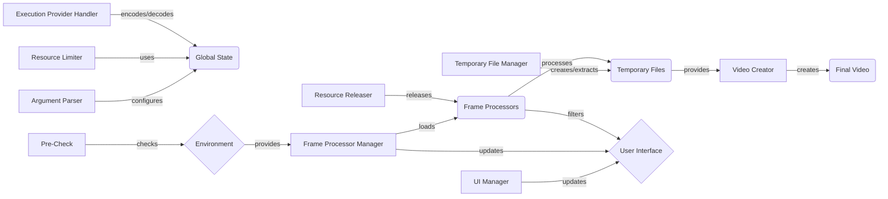

### Component Descriptions:

*   **Argument Parser**: Parses command-line arguments and populates the global configuration.
    *   Purpose: To configure the application based on user inputs.
    *   Interaction: Configures the Global State.
    *   Relevant source files: `repos.Deep-Live-Cam.modules.core:parse_args`

*   **Global State**: Manages global variables and configurations.
    *   Purpose: To store and provide access to global application settings.
    *   Interaction: Used by Resource Limiter and Execution Provider Handler.
    *   Relevant source files: `modules.globals`

*   **Resource Limiter**: Limits the application's resource usage.
    *   Purpose: To prevent memory leaks and crashes by limiting GPU memory growth and RAM usage.
    *   Interaction: Uses the Global State for configuration.
    *   Relevant source files: `repos.Deep-Live-Cam.modules.core:limit_resources`

*   **Pre-Check**: Performs initial environment checks.
    *   Purpose: To ensure the environment is set up correctly (Python version, ffmpeg).
    *   Interaction: Checks the Environment.
    *   Relevant source files: `repos.Deep-Live-Cam.modules.core:pre_check`

*   **Frame Processor Manager**: Loads and manages frame processors.
    *   Purpose: To load specified frame processors and manage their lifecycle.
    *   Interaction: Loads Frame Processors and updates the UI Manager.
    *   Relevant source files: `repos.Deep-Live-Cam.modules.core:start`, `modules.processors.frame.core:get_frame_processors_modules`

*   **Frame Processors**: Processes individual frames.
    *   Purpose: To apply various image processing techniques to each frame.
    *   Interaction: Processes Temporary Files, filters NSFW content for the UI Manager, and releases resources via Resource Releaser.
    *   Relevant source files: N/A (implementation varies)

*   **Temporary File Manager**: Creates, extracts, and cleans temporary files.
    *   Purpose: To handle temporary storage of frames during video processing.
    *   Interaction: Creates/extracts Temporary Files, which are then processed by Frame Processors.
    *   Relevant source files: `modules.utilities:create_temp`, `modules.utilities:extract_frames`, `modules.utilities:get_temp_frame_paths`, `modules.utilities:clean_temp`

*   **Video Creator**: Creates the final video from processed frames.
    *   Purpose: To combine processed frames into a final video, handling FPS and audio restoration.
    *   Interaction: Creates the Final Video from Temporary Files.
    *   Relevant source files: `modules.utilities:create_video`, `modules.utilities:restore_audio`

*   **UI Manager**: Initializes and manages the user interface.
    *   Purpose: To provide a user interface for monitoring and controlling the application.
    *   Interaction: Updates the User Interface based on input from Frame Processor Manager and NSFW filtering from Frame Processors.
    *   Relevant source files: `modules.ui:init`, `modules.ui:update_status`, `modules.ui:check_and_ignore_nsfw`

*   **Execution Provider Handler**: Encodes and decodes execution providers for ONNX Runtime.
    *   Purpose: To manage execution providers for ONNX Runtime.
    *   Interaction: Encodes/decodes execution providers in the Global State.
    *   Relevant source files: `repos.Deep-Live-Cam.modules.core:encode_execution_providers`, `repos.Deep-Live-Cam.modules.core:decode_execution_providers`

*   **Resource Releaser**: Releases resources after frame processing.
    *   Purpose: To prevent memory exhaustion by releasing CUDA memory after each frame.
    *   Interaction: Releases resources used by Frame Processors.
    *   Relevant source files: `repos.Deep-Live-Cam.modules.core:release_resources`
