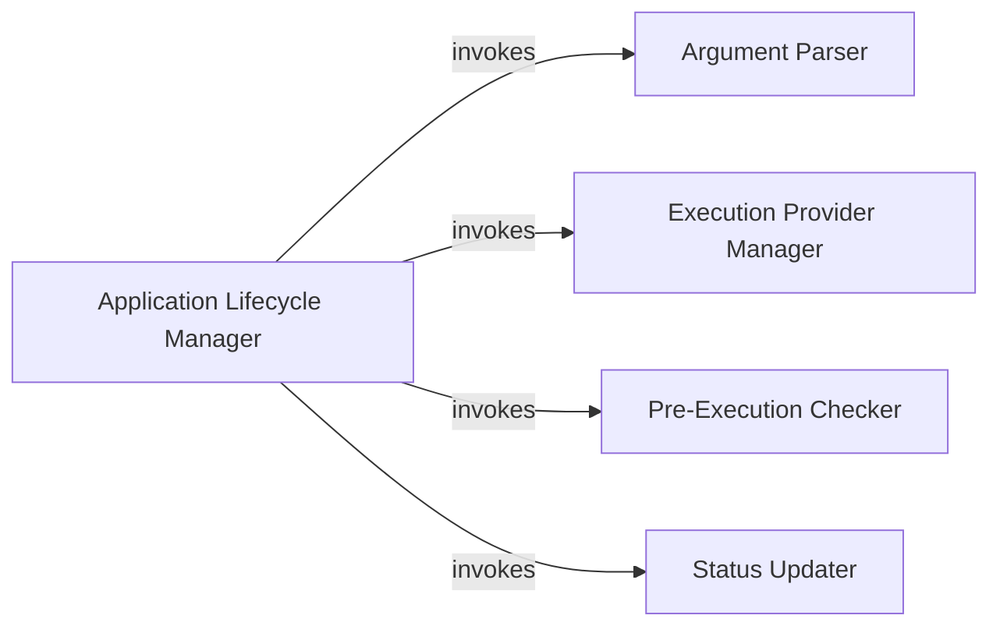

## Component Details

The Core Orchestrator manages the application's lifecycle, from initialization to shutdown. It parses command-line arguments, configures execution providers, performs pre-execution checks, and controls the main processing loop. The orchestrator ensures the proper coordination of other components, handles status updates, and manages resources for a clean exit.

### Argument Parser
The Argument Parser component is responsible for parsing command-line arguments using the `argparse` module. It defines the available arguments and their expected values, allowing users to customize the application's behavior. The parsed arguments are then used to configure other components.
- **Related Classes/Methods**: `Deep-Live-Cam.modules.core:parse_args`

### Execution Provider Manager
The Execution Provider Manager handles the decoding, validation, and suggestion of execution providers. It translates user-provided execution provider strings into usable objects, validates their correctness, and suggests suitable providers based on the system's capabilities. This ensures that the application uses the optimal execution settings.
- **Related Classes/Methods**: `Deep-Live-Cam.modules.core:decode_execution_providers`, `Deep-Live-Cam.modules.core:suggest_execution_providers`

### Pre-Execution Checker
The Pre-Execution Checker performs checks to ensure that all necessary resources and dependencies are available before the main loop starts. This includes verifying the existence of required files, checking hardware compatibility, and validating configurations. It prevents runtime errors by ensuring that the application's environment is properly set up.
- **Related Classes/Methods**: `Deep-Live-Cam.modules.core:pre_check`

### Status Updater
The Status Updater provides feedback to the user on the application's current state. It displays progress messages, error notifications, and other relevant information, allowing the user to monitor the application's execution and diagnose any issues.
- **Related Classes/Methods**: `Deep-Live-Cam.modules.core:update_status`

### Application Lifecycle Manager
The Application Lifecycle Manager is responsible for initializing the application, starting the main loop, and destroying the application upon completion or termination. It sets up resources, configures components, and ensures a clean exit by releasing resources and performing cleanup operations.
- **Related Classes/Methods**: `Deep-Live-Cam.modules.core:start`, `Deep-Live-Cam.modules.core:destroy`, `Deep-Live-Cam.modules.core:run`
