## Face Analysis Component Overview

This diagram illustrates the flow of the Face Analysis component, which is responsible for detecting, analyzing, and managing faces within images and video frames. It uses InsightFace for face detection and analysis, and includes functionalities for extracting unique faces and mapping source to target faces.

```mermaid
graph LR
    A[Target Image/Video] --> B(Unique Face Extractor)
    B -- Extracts --> C{Face Embeddings}
    C --> D(Cluster Analysis)
    D -- Identifies --> E{Unique Face Clusters}
    E --> F(Face Map Manager)
    F -- Creates --> G{Source-Target Face Map}
    G --> H(Default Target Face Selector)
    H -- Selects --> I{Default Target Face}
    I --> J(Frame Processing Pipeline)
    J -- Uses --> K{Modified Frame}

    style A fill:#f9f,stroke:#333,stroke-width:2px
    style B fill:#ccf,stroke:#333,stroke-width:2px
    style C fill:#f9f,stroke:#333,stroke-width:2px
    style D fill:#ccf,stroke:#333,stroke-width:2px
    style E fill:#f9f,stroke:#333,stroke-width:2px
    style F fill:#ccf,stroke:#333,stroke-width:2px
    style G fill:#f9f,stroke:#333,stroke-width:2px
    style H fill:#ccf,stroke:#333,stroke-width:2px
    style I fill:#f9f,stroke:#333,stroke-width:2px
    style J fill:#ccf,stroke:#333,stroke-width:2px
    style K fill:#f9f,stroke:#333,stroke-width:2px


```

### Component Descriptions:

-   **Target Image/Video:**
    -   *Description*: The input source, which can be either a single image or a video file, containing faces to be analyzed and potentially modified.
    -   *Functionality*: Provides the raw image or video data to the Face Analysis component.
    -   *Source Files*: N/A (Input)

-   **Unique Face Extractor:**
    -   *Description*: Extracts unique faces from the target image or video. For videos, it extracts frames and identifies unique faces across these frames.
    -   *Functionality*: Uses `get_many_faces` to detect faces, and extracts embeddings. For videos, it calls `extract_frames` to get individual frames.
    -   *Interactions*: Receives target image/video, sends face embeddings to Cluster Analysis.
    -   *Source Files*: `modules.face_analyser:get_unique_faces_from_target_image`, `modules.face_analyser:get_unique_faces_from_target_video`

-   **Face Embeddings:**
    -   *Description*: Numerical representations of detected faces, used for clustering and identification.
    -   *Functionality*: Stores the extracted face embeddings.
    -   *Source Files*: N/A (Data structure)

-   **Cluster Analysis:**
    -   *Description*: Groups face embeddings into clusters, identifying unique faces within the target video.
    -   *Functionality*: Uses `find_cluster_centroids` to group similar face embeddings.
    -   *Interactions*: Receives face embeddings, identifies unique face clusters.
    -   *Source Files*: `modules.cluster_analysis:find_cluster_centroids`

-   **Unique Face Clusters:**
    -   *Description*: Represents the unique faces identified in the target video, grouped by similarity.
    -   *Functionality*: Stores the clusters of unique faces.
    -   *Source Files*: N/A (Data structure)

-   **Face Map Manager:**
    -   *Description*: Manages the mapping between source and target faces, creating and simplifying face maps.
    -   *Functionality*: Creates `source_target_map` and simplifies it using `simplify_maps`.
    -   *Interactions*: Receives unique face clusters, creates source-target face map.
    -   *Source Files*: `modules.face_analyser:has_valid_map`, `modules.face_analyser:default_source_face`, `modules.face_analyser:simplify_maps`, `modules.face_analyser:add_blank_map`

-   **Source-Target Face Map:**
    -   *Description*: A data structure that stores the mapping between source faces (from the source image/video) and target faces (identified in the target image/video).
    -   *Functionality*: Stores the relationships between source and target faces.
    -   *Source Files*: N/A (Data structure)

-   **Default Target Face Selector:**
    -   *Description*: Selects the default target face from the identified faces, prioritizing faces with higher detection scores.
    -   *Functionality*: Uses `default_target_face` to select the best target face.
    -   *Interactions*: Receives source-target face map, selects default target face.
    -   *Source Files*: `modules.face_analyser:default_target_face`

-   **Default Target Face:**
    -   *Description*: The selected default target face, ready for use in the frame processing pipeline.
    -   *Functionality*: Represents the chosen target face.
    -   *Source Files*: N/A (Data structure)

-   **Frame Processing Pipeline:**
    -   *Description*: The component that uses the identified and selected faces to modify frames (e.g., face swapping, applying effects).
    -   *Functionality*: Utilizes the default target face to perform frame modifications.
    -   *Interactions*: Receives default target face, uses it to modify frames.
    -   *Source Files*: N/A (Downstream component)

-   **Modified Frame:**
    -   *Description*: The output frame after the face modification process.
    -   *Functionality*: Represents the final result of the frame processing.
    -   *Source Files*: N/A (Output)
