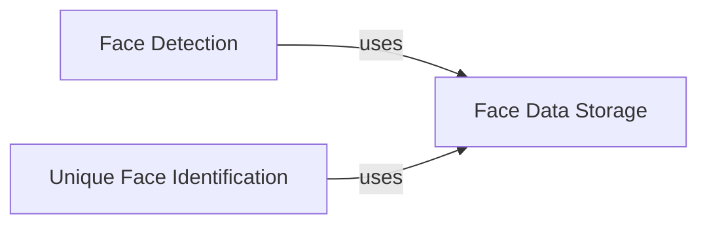

## Component Details

The Face Analyzer component provides functionalities for detecting and extracting faces from images and videos. It encompasses single and multiple face detection, unique face identification from both images and videos, and face data storage. The component serves as a fundamental building block for face-related processing tasks, enabling applications such as facial recognition, analysis, and modification.

### Face Detection
This component is responsible for detecting faces within an image or video frame. It offers two modes: single face detection, which quickly identifies one face, and multiple face detection, which exhaustively searches for all faces present. The detected faces are then passed on for further processing or storage.
- **Related Classes/Methods**: `Deep-Live-Cam.modules.face_analyser:get_one_face`, `Deep-Live-Cam.modules.face_analyser:get_many_faces`

### Unique Face Identification
This component identifies unique faces from a target image or video. It compares detected faces against a database or a set of known faces to filter out duplicates or known individuals. For videos, it tracks faces across frames to handle variations in pose, lighting, and occlusion, ensuring only unique faces are identified.
- **Related Classes/Methods**: `Deep-Live-Cam.modules.face_analyser:get_unique_faces_from_target_image`, `Deep-Live-Cam.modules.face_analyser:get_unique_faces_from_target_video`

### Face Data Storage
This component handles the storage of detected face data. It receives face data from the detection and identification components, formats it appropriately, and saves it to a designated storage location, such as a file system or database. This allows for later retrieval and use of the face data.
- **Related Classes/Methods**: `Deep-Live-Cam.modules.face_analyser:dump_faces`
