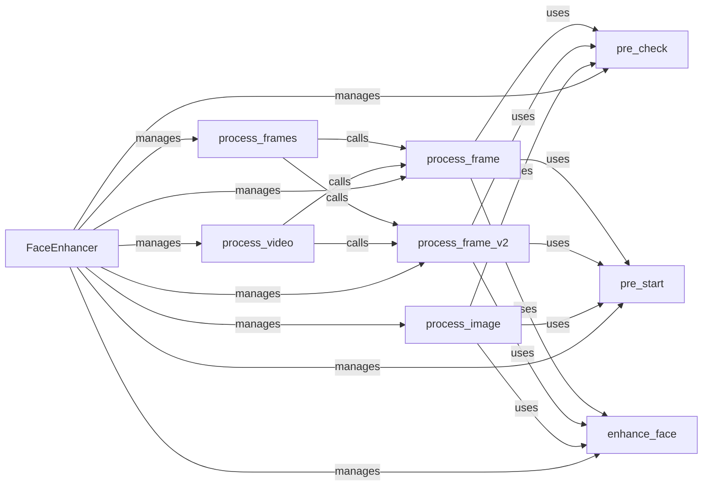

## Component Details

The Face Enhancement Processor enhances the visual quality of faces in images and videos. It begins with pre-checks and pre-start procedures to ensure proper setup and input validation. The core of the process involves enhancing detected faces using specialized algorithms. The processor supports various input types, including single frames, frame sequences, images, and videos, with optimized functions for each. It uses `enhance_face` to perform the actual enhancement, and `process_frame` and `process_frame_v2` to handle individual frames, offering alternative enhancement approaches. The processor intelligently manages resources and adapts its behavior based on the input type, ensuring efficient and effective face enhancement.

### FaceEnhancer
The main module responsible for orchestrating the face enhancement process. It provides a high-level interface for enhancing faces in frames, images, and videos.
- **Related Classes/Methods**: `Deep-Live-Cam.modules.processors.frame.face_enhancer`

### pre_check
This function performs preliminary checks to validate the input data and ensure that it meets the requirements for face enhancement. It prevents errors and ensures the smooth execution of the subsequent steps.
- **Related Classes/Methods**: `Deep-Live-Cam.modules.processors.frame.face_enhancer:pre_check`

### pre_start
This function initializes the necessary resources and sets up the environment for the face enhancement process. It prepares the system for efficient and effective enhancement.
- **Related Classes/Methods**: `Deep-Live-Cam.modules.processors.frame.face_enhancer:pre_start`

### enhance_face
This function implements the core face enhancement algorithm, improving the visual quality of detected faces. It is the heart of the face enhancement process.
- **Related Classes/Methods**: `Deep-Live-Cam.modules.processors.frame.face_enhancer:enhance_face`

### process_frame
This function processes a single frame for face enhancement, utilizing pre-checks, pre-start procedures, and the enhance_face function. It represents a standard approach to frame processing.
- **Related Classes/Methods**: `Deep-Live-Cam.modules.processors.frame.face_enhancer:process_frame`

### process_frame_v2
This function provides an alternative method for processing a single frame, potentially offering different enhancement techniques or optimizations compared to process_frame. It allows for flexibility in the enhancement process.
- **Related Classes/Methods**: `Deep-Live-Cam.modules.processors.frame.face_enhancer:process_frame_v2`

### process_frames
This function processes a sequence of frames, applying face enhancement to each frame. It efficiently handles multiple frames, leveraging either process_frame or process_frame_v2.
- **Related Classes/Methods**: `Deep-Live-Cam.modules.processors.frame.face_enhancer:process_frames`

### process_image
This function processes a single image for face enhancement, using pre-checks, pre-start procedures, and the enhance_face function. It is designed for static image enhancement.
- **Related Classes/Methods**: `Deep-Live-Cam.modules.processors.frame.face_enhancer:process_image`

### process_video
This function processes a video stream, applying face enhancement to each frame. It efficiently handles video input, utilizing either process_frame or process_frame_v2.
- **Related Classes/Methods**: `Deep-Live-Cam.modules.processors.frame.face_enhancer:process_video`
