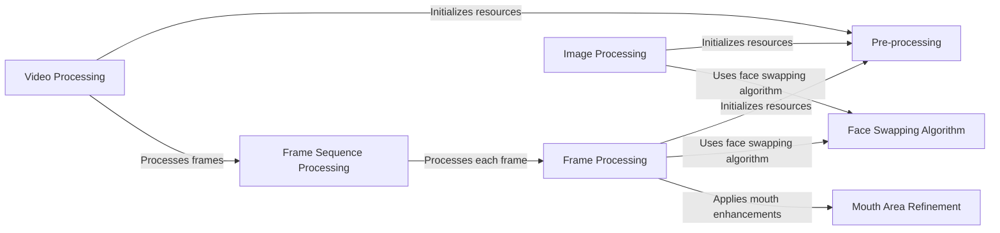

## Component Details

The Face Swapping Processor enables the replacement of faces in images and videos. It begins with pre-checks and initialization, followed by the core face swapping algorithm. The processor handles single frames, sequences of frames, and entire videos, with a post-processing step to refine the mouth area for realism. The main flow involves loading a source and target face, detecting facial landmarks, swapping the faces, and blending the result seamlessly into the original image or video.

### Pre-processing
This component encompasses the initial checks and setup required before face swapping can occur. It verifies the availability of necessary models and configurations, and initializes the environment by loading models and allocating resources.
- **Related Classes/Methods**: `Deep-Live-Cam.modules.processors.frame.face_swapper:pre_check`, `Deep-Live-Cam.modules.processors.frame.face_swapper:pre_start`

### Face Swapping Algorithm
This is the core component responsible for swapping faces between two images. It aligns the faces based on detected facial landmarks, blends the textures, and seamlessly integrates the swapped face into the target image.
- **Related Classes/Methods**: `Deep-Live-Cam.modules.processors.frame.face_swapper:swap_face`

### Frame Processing
This component processes a single frame to perform face swapping. It includes face detection, landmark extraction, face swapping using the 'Face Swapping Algorithm' component, and blending the result into the original frame.
- **Related Classes/Methods**: `Deep-Live-Cam.modules.processors.frame.face_swapper:process_frame`, `Deep-Live-Cam.modules.processors.frame.face_swapper:process_frame_v2`

### Frame Sequence Processing
This component processes multiple frames, typically as part of a video processing pipeline. It iterates through frames and applies the 'Frame Processing' component to each frame to perform face swapping on the entire video sequence.
- **Related Classes/Methods**: `Deep-Live-Cam.modules.processors.frame.face_swapper:process_frames`

### Image Processing
This component processes a single image to perform face swapping. Similar to 'Frame Processing' but operates on static images. It includes face detection, landmark extraction, and face swapping using the 'Face Swapping Algorithm' component.
- **Related Classes/Methods**: `Deep-Live-Cam.modules.processors.frame.face_swapper:process_image`

### Video Processing
This component processes a video to perform face swapping. It involves reading the video, processing each frame using the 'Frame Sequence Processing' component, and writing the modified frames back to a new video.
- **Related Classes/Methods**: `Deep-Live-Cam.modules.processors.frame.face_swapper:process_video`

### Mouth Area Refinement
This component applies specific modifications or enhancements to the mouth area after face swapping, potentially for improved realism or expression. This component refines the swapped face to better match the target's expressions.
- **Related Classes/Methods**: `Deep-Live-Cam.modules.processors.frame.face_swapper:apply_mouth_area`
