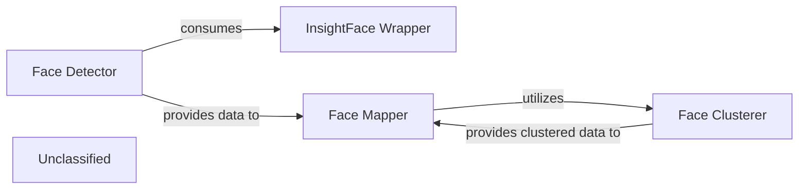

## Details

The face analysis subsystem is structured around four core components: `InsightFace Wrapper`, `Face Detector`, `Face Mapper`, and `Face Clusterer`. The `InsightFace Wrapper` initializes and manages the underlying `insightface` library, providing a standardized interface for face analysis capabilities. The `Face Detector` leverages this wrapper to identify and extract faces from input frames, outputting bounding boxes, landmarks, and embeddings. The `Face Mapper` then consumes these detected faces, managing the complex logic of mapping source faces to target faces, especially for operations like face swapping. For video processing, the `Face Mapper` utilizes the `Face Clusterer` to group unique faces across frames, ensuring consistent identity tracking. The `Face Clusterer` processes face embeddings to identify distinct individuals over time and provides this clustered data back to the `Face Mapper` for refined mapping. This architecture ensures a clear separation of concerns, from low-level face analysis to high-level face mapping and identity management.

### InsightFace Wrapper
This component serves as an abstraction layer for the `insightface` library, handling the initialization and configuration of the underlying `FaceAnalysis` model. It provides a standardized, simplified interface for accessing `insightface`'s core capabilities, including face detection, landmark extraction, and embedding generation, thereby decoupling the rest of the system from direct `insightface` implementation details.

**Related Classes/Methods**:

- <a href="https://github.com/hacksider/Deep-Live-Cam/blob/main/modules/face_analyser.py#L18-L24" target="_blank" rel="noopener noreferrer">`modules.face_analyser.get_face_analyser`:18-24</a>

### Face Detector
Responsible for identifying and localizing faces within input frames (images or video). It processes frames to output bounding boxes, facial landmarks, and unique face embeddings for each detected face. This component is fundamental for any subsequent face-related processing.

**Related Classes/Methods**:

- <a href="https://github.com/hacksider/Deep-Live-Cam/blob/main/modules/face_analyser.py#L27-L32" target="_blank" rel="noopener noreferrer">`modules.face_analyser.get_one_face`:27-32</a>
- <a href="https://github.com/hacksider/Deep-Live-Cam/blob/main/modules/face_analyser.py#L35-L39" target="_blank" rel="noopener noreferrer">`modules.face_analyser.get_many_faces`:35-39</a>

### Face Mapper
Manages the logical mapping between source and target faces, which is crucial for operations like face swapping. It handles the identification and organization of unique faces from both static images and dynamic video inputs, populating and manipulating the `source_target_map`. It also includes logic for selecting default source and target faces and simplifying mapping configurations.

**Related Classes/Methods**:

- <a href="https://github.com/hacksider/Deep-Live-Cam/blob/main/modules/face_analyser.py#L76-L94" target="_blank" rel="noopener noreferrer">`modules.face_analyser.get_unique_faces_from_target_image`:76-94</a>
- <a href="https://github.com/hacksider/Deep-Live-Cam/blob/main/modules/face_analyser.py#L97-L143" target="_blank" rel="noopener noreferrer">`modules.face_analyser.get_unique_faces_from_target_video`:97-143</a>
- <a href="https://github.com/hacksider/Deep-Live-Cam/blob/main/modules/face_analyser.py#L146-L168" target="_blank" rel="noopener noreferrer">`modules.face_analyser.default_target_face`:146-168</a>
- <a href="https://github.com/hacksider/Deep-Live-Cam/blob/main/modules/face_analyser.py#L53-L62" target="_blank" rel="noopener noreferrer">`modules.face_analyser.simplify_maps`:53-62</a>
- <a href="https://github.com/hacksider/Deep-Live-Cam/blob/main/modules/face_analyser.py#L64-L74" target="_blank" rel="noopener noreferrer">`modules.face_analyser.add_blank_map`:64-74</a>
- <a href="https://github.com/hacksider/Deep-Live-Cam/blob/main/modules/face_analyser.py#L41-L45" target="_blank" rel="noopener noreferrer">`modules.face_analyser.has_valid_map`:41-45</a>
- <a href="https://github.com/hacksider/Deep-Live-Cam/blob/main/modules/face_analyser.py#L47-L51" target="_blank" rel="noopener noreferrer">`modules.face_analyser.default_source_face`:47-51</a>

### Face Clusterer
This component is responsible for analyzing face embeddings over time, particularly in video streams, to identify and group unique individuals. It applies clustering algorithms to face embeddings to maintain consistent identities for faces throughout a video, which is essential for accurate tracking and mapping in dynamic scenarios.

**Related Classes/Methods**:

- <a href="https://github.com/hacksider/Deep-Live-Cam/blob/main/modules/face_analyser.py#L97-L143" target="_blank" rel="noopener noreferrer">`modules.face_analyser.get_unique_faces_from_target_video`:97-143</a>
- <a href="https://github.com/hacksider/Deep-Live-Cam/blob/main/modules/cluster_analysis.py#L7-L21" target="_blank" rel="noopener noreferrer">`modules.cluster_analysis.find_cluster_centroids`:7-21</a>
- <a href="https://github.com/hacksider/Deep-Live-Cam/blob/main/modules/cluster_analysis.py#L23-L32" target="_blank" rel="noopener noreferrer">`modules.cluster_analysis.find_closest_centroid`:23-32</a>

### Unclassified
Component for all unclassified files and utility functions (Utility functions/External Libraries/Dependencies)

**Related Classes/Methods**: _None_

### [FAQ](https://github.com/CodeBoarding/GeneratedOnBoardings/tree/main?tab=readme-ov-file#faq)