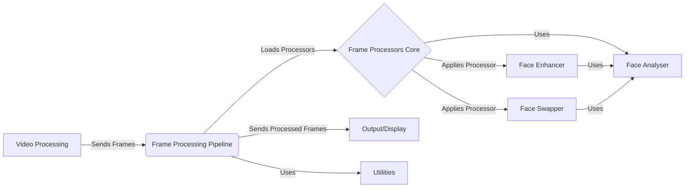

## Frame Processing Pipeline Overview

This document provides an overview of the Frame Processing Pipeline, a crucial component responsible for loading, managing, and applying a chain of frame processors to modify video frames. These processors can include face swappers, enhancers, and other custom effects.

### Data Flow Diagram

### Component Descriptions

*   **Video Processing:** This component is responsible for capturing or loading video frames. It sends the raw frames to the Frame Processing Pipeline for modification.
    *   **Relevant Source Files:** `modules.video_capture.VideoCapturer`

*   **Frame Processing Pipeline:** This is the central component that orchestrates the frame processing. It loads the configured frame processors, applies them sequentially to each frame, and sends the processed frames to the output or display.
    *   **Relevant Source Files:** `modules.processors.frame.core`

*   **Frame Processors Core:** Manages the loading and application of frame processors. It dynamically loads processor modules and manages their state based on UI settings. It also handles multi-processing of frames.
    *   **Relevant Source Files:** `modules.processors.frame.core`

*   **Face Enhancer:** Enhances the quality of faces detected in video frames. It uses the GFPGAN model to improve facial features and overall clarity.
    *   **Relevant Source Files:** `modules.processors.frame.face_enhancer`

*   **Face Swapper:** Swaps faces between a source and target image/video. It uses InsightFace for face detection and swapping, with options for mouth masking and color correction.
    *   **Relevant Source Files:** `modules.processors.frame.face_swapper`

*   **Face Analyser:** Detects and analyses faces in images and videos, providing functionalities to get one or many faces from a frame. It uses InsightFace for face detection and analysis. Used by both Face Enhancer and Face Swapper.
    *   **Relevant Source Files:** `modules.face_analyser`

*   **Utilities:** Provides utility functions for file handling, conditional downloads, and FFmpeg operations. Used for tasks like extracting frames and creating videos.
    *   **Relevant Source Files:** `modules.utilities`

*   **Output/Display:** This component receives the processed frames from the Frame Processing Pipeline and displays them or saves them to a file.
