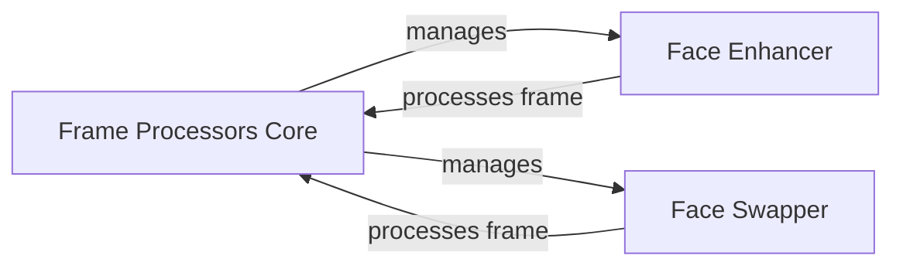

## Component Details

The Frame Processor component orchestrates video processing effects on individual frames. It manages available frame processors like Face Enhancer and Face Swapper, providing functionalities to retrieve and set these processors from the UI. The component's core function is to process video streams, applying selected effects frame by frame.

### Frame Processors Core
This module serves as the central hub for managing and orchestrating frame processors. It dynamically loads available processors, such as face enhancers and face swappers, and provides an interface for setting these processors via the UI. Its primary responsibility is to process video streams by applying the selected frame processors to each frame in the video.
- **Related Classes/Methods**: `Deep-Live-Cam.modules.processors.frame.core:get_frame_processors_modules`, `Deep-Live-Cam.modules.processors.frame.core:set_frame_processors_modules_from_ui`, `Deep-Live-Cam.modules.processors.frame.core:process_video`

### Face Enhancer
The Face Enhancer module focuses on enhancing the quality and appearance of faces within a frame. It offers functionalities for pre-processing checks and configurations, along with the core logic for face enhancement. It can operate on single frames, multiple frames, images, and videos, providing flexibility in how face enhancement is applied.
- **Related Classes/Methods**: `Deep-Live-Cam.modules.processors.frame.face_enhancer:pre_check`, `Deep-Live-Cam.modules.processors.frame.face_enhancer:pre_start`, `Deep-Live-Cam.modules.processors.frame.face_enhancer:enhance_face`, `Deep-Live-Cam.modules.processors.frame.face_enhancer:process_frame`, `Deep-Live-Cam.modules.processors.frame.face_enhancer:process_frames`, `Deep-Live-Cam.modules.processors.frame.face_enhancer:process_image`, `Deep-Live-Cam.modules.processors.frame.face_enhancer:process_video`, `Deep-Live-Cam.modules.processors.frame.face_enhancer:process_frame_v2`

### Face Swapper
The Face Swapper module is designed to replace faces within a frame with other faces. It includes pre-processing checks, configurations, and the core face swapping logic. It supports processing single frames, multiple frames, images, and videos. Additionally, it provides functionality to apply the mouth area from the source face to the swapped face, enhancing realism.
- **Related Classes/Methods**: `Deep-Live-Cam.modules.processors.frame.face_swapper:pre_check`, `Deep-Live-Cam.modules.processors.frame.face_swapper:pre_start`, `Deep-Live-Cam.modules.processors.frame.face_swapper:swap_face`, `Deep-Live-Cam.modules.processors.frame.face_swapper:process_frame`, `Deep-Live-Cam.modules.processors.frame.face_swapper:process_frame_v2`, `Deep-Live-Cam.modules.processors.frame.face_swapper:process_frames`, `Deep-Live-Cam.modules.processors.frame.face_swapper:process_image`, `Deep-Live-Cam.modules.processors.frame.face_swapper:process_video`, `Deep-Live-Cam.modules.processors.frame.face_swapper:apply_mouth_area`
