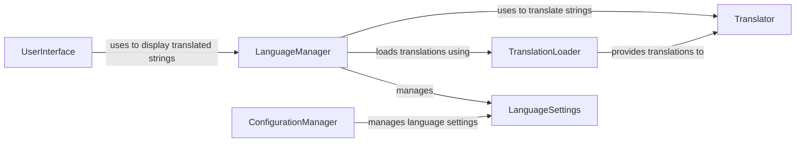

## Component Details

The Language Manager component is responsible for managing the application's localization and internationalization features. It handles loading translations from files, providing translated strings to the application, and managing language settings. The component ensures that the application can be used in different languages by providing the necessary tools and functions to translate the user interface and other text elements.

### LanguageManager
The LanguageManager is the central component for managing the application's localization. It initializes the translation system, loads the appropriate translations based on the user's language settings, and provides methods for retrieving translated strings. It also manages the application's language settings, such as the currently selected language and available languages.
- **Related Classes/Methods**: `Deep-Live-Cam.modules.gettext.LanguageManager`

### TranslationLoader
The TranslationLoader component is responsible for loading translation files (e.g., .mo files) from the file system. It parses these files and makes the translations available to the LanguageManager. This component handles different translation file formats and ensures that the translations are loaded correctly.
- **Related Classes/Methods**: _None_

### Translator
The Translator component provides the functionality to translate strings from one language to another. It uses the loaded translations from the TranslationLoader to perform the actual translation process. This component may also handle pluralization and other language-specific rules.
- **Related Classes/Methods**: _None_

### LanguageSettings
The LanguageSettings component stores and manages the application's language settings, such as the currently selected language and available languages. It provides methods for getting and setting the language settings, and it may also persist these settings to a file or database.
- **Related Classes/Methods**: _None_

### ConfigurationManager
The ConfigurationManager component is responsible for managing the application's configuration, including the language settings. It provides methods for reading and writing configuration files, and it ensures that the configuration is loaded correctly.
- **Related Classes/Methods**: _None_

### UserInterface
The UserInterface component represents the application's user interface. It uses the LanguageManager to display translated strings to the user. This component may also provide a way for the user to change the language settings.
- **Related Classes/Methods**: _None_
