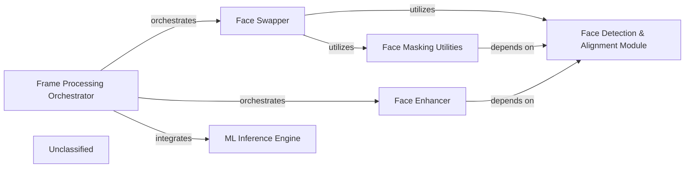

## Details

The system is designed around a modular, frame-based video processing pipeline, primarily focused on face manipulation. The Frame Processing Orchestrator acts as the central coordinator, managing the sequential application of various frame processors. Key components include the Face Detection & Alignment Module for initial facial data extraction, the ML Inference Engine for executing specialized models like NSFW detection, the Face Swapper for core face replacement, the Face Enhancer for visual quality improvements, and Face Masking Utilities for precise mask generation. This architecture ensures a structured and extensible approach to deepfake generation and related video processing tasks.

### ML Inference Engine
This component is responsible for loading and executing machine learning models, specifically for content prediction (e.g., NSFW detection). It provides a generalized interface for model predictions, ensuring that frames are processed according to predefined safety or content guidelines.

**Related Classes/Methods**:

- <a href="https://github.com/hacksider/Deep-Live-Cam/blob/main/modules/predicter.py#L14-L27" target="_blank" rel="noopener noreferrer">`modules.predicter.predict_frame`:14-27</a>
- <a href="https://github.com/hacksider/Deep-Live-Cam/blob/main/modules/predicter.py#L30-L31" target="_blank" rel="noopener noreferrer">`modules.predicter.predict_image`:30-31</a>
- <a href="https://github.com/hacksider/Deep-Live-Cam/blob/main/modules/predicter.py#L34-L36" target="_blank" rel="noopener noreferrer">`modules.predicter.predict_video`:34-36</a>

### Frame Processing Orchestrator
Manages the overall flow and sequence of frame-level processing operations. It coordinates the execution of different stages, such as face swapping and enhancement, ensuring they are applied in the correct order and their outputs are integrated seamlessly. It dynamically loads and manages frame processor modules.

**Related Classes/Methods**:

- <a href="https://github.com/hacksider/Deep-Live-Cam/blob/main/modules/processors/frame/core.py#L79-L84" target="_blank" rel="noopener noreferrer">`modules.processors.frame.core.process_video`:79-84</a>
- <a href="https://github.com/hacksider/Deep-Live-Cam/blob/main/modules/processors/frame/core.py#L33-L41" target="_blank" rel="noopener noreferrer">`modules.processors.frame.core.get_frame_processors_modules`:33-41</a>

### Face Detection & Alignment Module
Provides crucial facial data, including bounding boxes and landmark points, for both source and target faces within a frame. This information is a prerequisite for accurate face manipulation, masking, and alignment in subsequent processing steps.

**Related Classes/Methods**:

- <a href="https://github.com/hacksider/Deep-Live-Cam/blob/main/modules/face_analyser.py#L27-L32" target="_blank" rel="noopener noreferrer">`modules.face_analyser.get_one_face`:27-32</a>
- <a href="https://github.com/hacksider/Deep-Live-Cam/blob/main/modules/face_analyser.py#L35-L39" target="_blank" rel="noopener noreferrer">`modules.face_analyser.get_many_faces`:35-39</a>
- <a href="https://github.com/hacksider/Deep-Live-Cam/blob/main/modules/face_analyser.py" target="_blank" rel="noopener noreferrer">`modules.face_analyser.find_similar_face`</a>

### Face Swapper
Implements the core face replacement functionality. It utilizes detected face data, loads and executes the InsightFace ONNX model, performs the actual face replacement, and applies post-swapping refinements like blending, opacity adjustments, sharpening, and temporal interpolation for smooth transitions.

**Related Classes/Methods**:

- <a href="https://github.com/hacksider/Deep-Live-Cam/blob/main/modules/processors/frame/face_swapper.py#L34-L42" target="_blank" rel="noopener noreferrer">`modules.processors.frame.face_swapper.pre_check`:34-42</a>
- <a href="https://github.com/hacksider/Deep-Live-Cam/blob/main/modules/processors/frame/face_swapper.py#L45-L58" target="_blank" rel="noopener noreferrer">`modules.processors.frame.face_swapper.pre_start`:45-58</a>
- <a href="https://github.com/hacksider/Deep-Live-Cam/blob/main/modules/processors/frame/face_swapper.py#L289-L325" target="_blank" rel="noopener noreferrer">`modules.processors.frame.face_swapper.process_frame`:289-325</a>

### Face Enhancer
Focuses on improving the visual quality and realism of faces within frames. It loads and manages the GFPGAN model, applying high-quality face enhancement. It intelligently selects and utilizes the optimal hardware device (CUDA, MPS for Mac, or CPU) for efficient processing.

**Related Classes/Methods**:

- <a href="https://github.com/hacksider/Deep-Live-Cam/blob/main/modules/processors/frame/face_enhancer.py#L33-L41" target="_blank" rel="noopener noreferrer">`modules.processors.frame.face_enhancer.pre_check`:33-41</a>
- <a href="https://github.com/hacksider/Deep-Live-Cam/blob/main/modules/processors/frame/face_enhancer.py#L44-L50" target="_blank" rel="noopener noreferrer">`modules.processors.frame.face_enhancer.pre_start`:44-50</a>
- <a href="https://github.com/hacksider/Deep-Live-Cam/blob/main/modules/processors/frame/face_enhancer.py#L144-L156" target="_blank" rel="noopener noreferrer">`modules.processors.frame.face_enhancer.process_frame`:144-156</a>

### Face Masking Utilities
Provides essential functions for generating various types of facial masks (e.g., general face area, lower mouth, eyes) based on facial landmarks. It also includes utilities for color transfer, which are critical for achieving seamless integration and targeted modifications during face swapping and other post-processing steps.

**Related Classes/Methods**:

- <a href="https://github.com/hacksider/Deep-Live-Cam/blob/main/modules/processors/frame/face_masking.py" target="_blank" rel="noopener noreferrer">`modules.processors.frame.face_masking.get_face_mask`</a>
- <a href="https://github.com/hacksider/Deep-Live-Cam/blob/main/modules/processors/frame/face_masking.py" target="_blank" rel="noopener noreferrer">`modules.processors.frame.face_masking.get_blur_size`</a>
- <a href="https://github.com/hacksider/Deep-Live-Cam/blob/main/modules/processors/frame/face_masking.py" target="_blank" rel="noopener noreferrer">`modules.processors.frame.face_masking.apply_color_correction`</a>

### Unclassified
Component for all unclassified files and utility functions (Utility functions/External Libraries/Dependencies)

**Related Classes/Methods**: _None_

### [FAQ](https://github.com/CodeBoarding/GeneratedOnBoardings/tree/main?tab=readme-ov-file#faq)