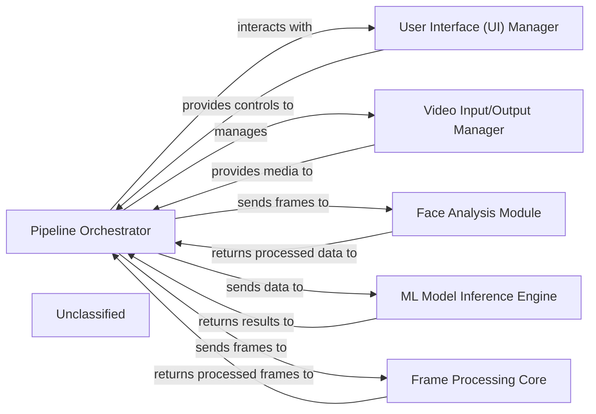

## Details

The system is designed around a central Pipeline Orchestrator that manages the flow of media processing. It interacts with a User Interface (UI) Manager for user interaction and feedback, and a Video Input/Output Manager for handling input and output media streams. The orchestrator dynamically integrates various Frame Processing Core modules, which include specialized components such as the Face Analysis Module for detecting and analyzing faces, and the ML Model Inference Engine for applying machine learning models to the processed data. This modular architecture ensures flexibility and efficient execution of complex media transformations.

### Pipeline Orchestrator [[Expand]](./Pipeline_Orchestrator.md)
The central control unit responsible for parsing arguments, managing the overall application workflow, coordinating data flow between processing stages, and orchestrating the execution of frame processors.

**Related Classes/Methods**:

- <a href="https://github.com/hacksider/Deep-Live-Cam/blob/main/modules/core.py" target="_blank" rel="noopener noreferrer">`modules.core`</a>

### User Interface (UI) Manager
Manages user interactions, provides controls for pipeline configuration, and displays real-time feedback and processed results. It initializes the graphical interface and updates status messages.

**Related Classes/Methods**:

- <a href="https://github.com/hacksider/Deep-Live-Cam/blob/main/modules/ui.py" target="_blank" rel="noopener noreferrer">`modules.ui`</a>

### Video Input/Output Manager
Handles the acquisition of raw input video streams (e.g., from cameras, files) and the output of processed video frames, including frame extraction, video creation, and audio restoration.

**Related Classes/Methods**:

- <a href="https://github.com/hacksider/Deep-Live-Cam/blob/main/modules/capturer.py" target="_blank" rel="noopener noreferrer">`modules.capturer`</a>

### Face Analysis Module
Specializes in performing face detection, landmarking, and alignment on input frames, preparing data for subsequent ML models.

**Related Classes/Methods**:

- <a href="https://github.com/hacksider/Deep-Live-Cam/blob/main/modules/face_analyser.py" target="_blank" rel="noopener noreferrer">`modules.face_analyser`</a>

### ML Model Inference Engine
Manages the loading, execution, and output of various machine learning models (e.g., deepfake, face swapping) on processed data.

**Related Classes/Methods**:

- <a href="https://github.com/hacksider/Deep-Live-Cam/blob/main/modules/predicter.py" target="_blank" rel="noopener noreferrer">`modules.predicter`</a>

### Frame Processing Core
Orchestrates a sequence of frame-level transformations and post-processing steps, applying various effects or enhancements to frames before output. It provides the interface for individual frame processors.

**Related Classes/Methods**:

- <a href="https://github.com/hacksider/Deep-Live-Cam/blob/main/modules/processors/frame/core.py" target="_blank" rel="noopener noreferrer">`modules.processors.frame.core`</a>

### Unclassified
Component for all unclassified files and utility functions (Utility functions/External Libraries/Dependencies)

**Related Classes/Methods**: _None_

### [FAQ](https://github.com/CodeBoarding/GeneratedOnBoardings/tree/main?tab=readme-ov-file#faq)