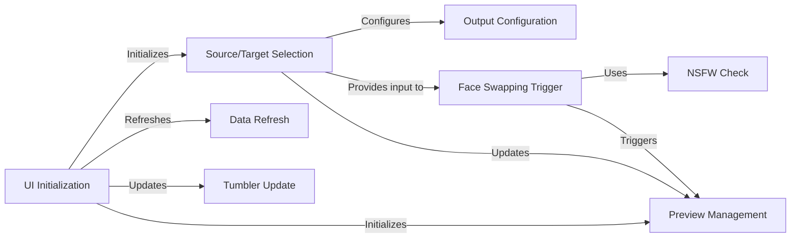

## Component Details

The User Interface Manager provides a graphical interface for users to interact with the application. It encompasses several key components that work together to provide a seamless user experience. The UI Initialization sets up the main window and basic components. Source/Target Selection handles the selection of source and target faces, either from files or webcam. Preview Management manages the video previews, including initialization, updating, and toggling. Output Configuration allows the user to select the output path for the processed video. Face Swapping Trigger initiates the face swapping process. Data Refresh ensures that the displayed information is up-to-date. NSFW Check prevents inappropriate content from being processed. Tumbler Update allows users to adjust certain parameters or settings.

### UI Initialization
Initializes the UI, setting up the main window and basic components. This includes creating the root window and setting up the initial layout.
- **Related Classes/Methods**: `Deep-Live-Cam.modules.ui:init`, `Deep-Live-Cam.modules.ui:create_root`

### Source/Target Selection
Handles the selection of source and target faces, either from files or webcam. This involves creating popups for selecting faces and updating the selected faces in the UI.
- **Related Classes/Methods**: `Deep-Live-Cam.modules.ui:select_source_path`, `Deep-Live-Cam.modules.ui:select_target_path`, `Deep-Live-Cam.modules.ui:create_source_target_popup`, `Deep-Live-Cam.modules.ui:create_source_target_popup_for_webcam`, `Deep-Live-Cam.modules.ui:update_popup_source`, `Deep-Live-Cam.modules.ui:update_webcam_source`, `Deep-Live-Cam.modules.ui:update_webcam_target`

### Preview Management
Manages the video previews, including initialization, updating, and toggling. This involves creating and updating the preview display, as well as handling webcam previews.
- **Related Classes/Methods**: `Deep-Live-Cam.modules.ui:create_preview`, `Deep-Live-Cam.modules.ui:init_preview`, `Deep-Live-Cam.modules.ui:update_preview`, `Deep-Live-Cam.modules.ui:toggle_preview`, `Deep-Live-Cam.modules.ui:webcam_preview`, `Deep-Live-Cam.modules.ui:create_webcam_preview`

### Output Configuration
Allows the user to select the output path for the processed video. This involves providing a file selection dialog and storing the selected path.
- **Related Classes/Methods**: `Deep-Live-Cam.modules.ui:select_output_path`

### Face Swapping Trigger
Triggers the face swapping process with the selected source and target faces. This involves initiating the analysis of the target face and swapping faces based on the selected paths.
- **Related Classes/Methods**: `Deep-Live-Cam.modules.ui:swap_faces_paths`, `Deep-Live-Cam.modules.ui:analyze_target`

### Data Refresh
Refreshes the UI data, ensuring that the displayed information is up-to-date.
- **Related Classes/Methods**: `Deep-Live-Cam.modules.ui:refresh_data`

### NSFW Check
Checks and ignores NSFW content, preventing inappropriate content from being processed.
- **Related Classes/Methods**: `Deep-Live-Cam.modules.ui:check_and_ignore_nsfw`

### Tumbler Update
Updates the tumbler, likely referring to a UI element that allows users to adjust certain parameters or settings.
- **Related Classes/Methods**: `Deep-Live-Cam.modules.ui:update_tumbler`
