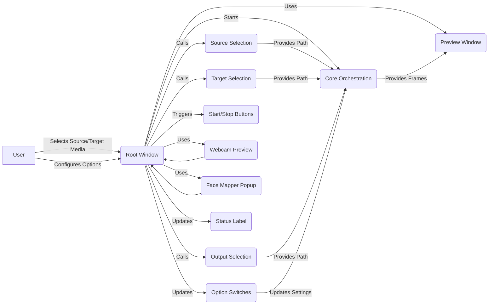

## User Interface Overview

The User Interface (UI) provides a graphical interface for user interaction, allowing users to select source and target media, preview results, and configure settings. It communicates user inputs to the Core Orchestration.

Here's a data flow diagram illustrating the UI's role in the application:

### Component Descriptions:

*   **Root Window**: The main application window, responsible for holding all UI elements and managing the application lifecycle. It interacts with all other UI components and the Core Orchestration.
    *   Source files: `repos.Deep-Live-Cam.modules.ui`
*   **Preview Window**: A secondary window that displays the processed output, allowing users to preview the results before starting the main process. It receives frames from the Core Orchestration.
    *   Source files: `repos.Deep-Live-Cam.modules.ui`
*   **Source Selection**: Handles the selection of the source image or video, displaying a preview and storing the path. It provides the source path to the Core Orchestration.
    *   Source files: `repos.Deep-Live-Cam.modules.ui`
*   **Target Selection**: Handles the selection of the target image or video, displaying a preview and storing the path. It provides the target path to the Core Orchestration.
    *   Source files: `repos.Deep-Live-Cam.modules.ui`
*   **Output Selection**: Handles the selection of the output path and filename for the processed media. It provides the output path to the Core Orchestration.
    *   Source files: `repos.Deep-Live-Cam.modules.ui`
*   **Option Switches**: Manages the state of various boolean options, such as 'Keep FPS', 'Keep Audio', and 'NSFW Filter', and updates the global settings accordingly. It updates settings in the Core Orchestration.
    *   Source files: `repos.Deep-Live-Cam.modules.ui`
*   **Start/Stop Buttons**: Triggers the start and stop of the processing pipeline. It signals the Core Orchestration to start or stop.
    *   Source files: `repos.Deep-Live-Cam.modules.ui`
*   **Webcam Preview**: Handles the live webcam preview functionality, including camera selection and display. It displays the webcam feed in the Preview Window.
    *   Source files: `repos.Deep-Live-Cam.modules.ui`
*   **Face Mapper Popup**: A popup window that allows users to map source faces to target faces when the 'Map Faces' option is enabled. It sends face mappings to the Core Orchestration.
    *   Source files: `repos.Deep-Live-Cam.modules.ui`
*   **Status Label**: Displays status messages to the user, providing feedback on the application's current state. It receives status updates from various components.
    *   Source files: `repos.Deep-Live-Cam.modules.ui`
