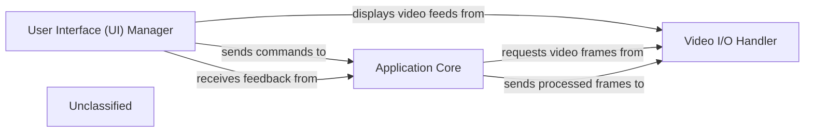

## Details

The application's architecture is structured around three primary components: the User Interface (UI) Manager, the Application Core, and the Video I/O Handler. The UI Manager provides the interactive front-end, allowing users to control the application and visualize results. It communicates user commands to the Application Core, which orchestrates the core processing logic, including face analysis and frame manipulation, while also managing global application settings. The Video I/O Handler is responsible for all video input and output, supplying raw video frames to the Application Core for processing and displaying the processed output back through the UI Manager. This clear separation of concerns ensures a modular and maintainable system, where the UI focuses on presentation, the Application Core on business logic, and the Video I/O Handler on media management.

### User Interface (UI) Manager
This is the central component of the UI subsystem, responsible for orchestrating all user-facing elements and interactions. It manages user input, displays video feeds, and provides application controls, serving as the primary interface for users to interact with the ML pipeline. This component aligns with the "User Interface (GUI)" pattern expected in ML Toolkit / Desktop Applications, acting as the View and Controller in an MVC/MVVM pattern.

**Related Classes/Methods**:

- <a href="https://github.com/hacksider/Deep-Live-Cam/blob/main/modules/ui.py#L83-L91" target="_blank" rel="noopener noreferrer">`modules.ui.init`:83-91</a>

### Application Core
This component encapsulates the main business logic of the application. It processes user commands received from the UI, manages global application settings, and orchestrates the various processing modules like face analysis and frame processing.

**Related Classes/Methods**:

- <a href="https://github.com/hacksider/Deep-Live-Cam/blob/main/modules/globals.py" target="_blank" rel="noopener noreferrer">`modules.globals`</a>
- <a href="https://github.com/hacksider/Deep-Live-Cam/blob/main/modules/face_analyser.py" target="_blank" rel="noopener noreferrer">`modules.face_analyser`</a>
- <a href="https://github.com/hacksider/Deep-Live-Cam/blob/main/modules/processors/frame/core.py" target="_blank" rel="noopener noreferrer">`modules.processors.frame.core`</a>

### Video I/O Handler
This component is responsible for managing all video input and output operations. It handles capturing video from various sources (e.g., webcams, video files) and providing video frames for processing, as well as displaying the processed video output.

**Related Classes/Methods**:

- <a href="https://github.com/hacksider/Deep-Live-Cam/blob/main/modules/video_capture.py#L12-L94" target="_blank" rel="noopener noreferrer">`modules.video_capture.VideoCapturer`:12-94</a>

### Unclassified
Component for all unclassified files and utility functions (Utility functions/External Libraries/Dependencies)

**Related Classes/Methods**: _None_

### [FAQ](https://github.com/CodeBoarding/GeneratedOnBoardings/tree/main?tab=readme-ov-file#faq)