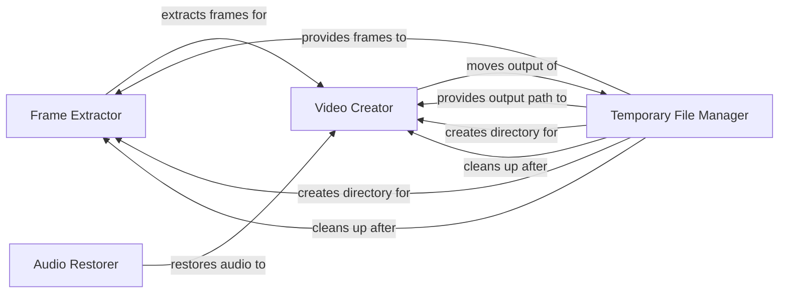

## Component Details

The Utilities component provides essential utility functions for video processing, file management, and temporary file handling within the Deep-Live-Cam project. It encompasses functionalities for extracting frames from videos, creating videos from frames, restoring audio to processed videos, and managing temporary files and directories used during the video processing pipeline. The component ensures proper creation, usage, and cleanup of temporary resources, supporting the overall video processing workflow.

### Frame Extractor
The Frame Extractor component extracts individual frames from a video file and saves them as image files in a temporary directory. It leverages the ffmpeg library to decode the video and save each frame as a separate image file, enabling further processing of individual frames.
- **Related Classes/Methods**: `Deep-Live-Cam.modules.utilities:extract_frames`

### Video Creator
The Video Creator component creates a video file from a sequence of image files (frames) located in a specified directory. It uses the ffmpeg library to encode the images into a video file, effectively reconstructing a video from processed frames.
- **Related Classes/Methods**: `Deep-Live-Cam.modules.utilities:create_video`

### Audio Restorer
The Audio Restorer component restores the audio from the original video file to the newly created video file. It uses the ffmpeg library to copy the audio stream from the original video to the new video, ensuring that the processed video retains its original audio.
- **Related Classes/Methods**: `Deep-Live-Cam.modules.utilities:restore_audio`

### Temporary File Manager
The Temporary File Manager component handles the creation, retrieval, and cleanup of temporary files and directories used during video processing. It provides functions to generate paths for temporary frame files and output video files, as well as functions to create, move, and delete temporary directories, ensuring proper resource management and preventing file clutter.
- **Related Classes/Methods**: `Deep-Live-Cam.modules.utilities:get_temp_frame_paths`, `Deep-Live-Cam.modules.utilities:get_temp_output_path`, `Deep-Live-Cam.modules.utilities:create_temp`, `Deep-Live-Cam.modules.utilities:move_temp`, `Deep-Live-Cam.modules.utilities:clean_temp`
