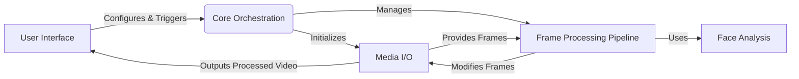

## Deep-Live-Cam: Project Overview

Deep-Live-Cam is a real-time video processing application that allows users to modify video streams from webcams or video files by swapping faces and applying enhancements. It provides a user interface for selecting sources and targets, configuring processing options, and previewing the results.

## Data Flow Diagram

## Component Descriptions

**User Interface:** This component provides the graphical interface for user interaction. It allows users to select the video source (webcam or file), the target face for swapping, and preview the processed video. It configures and triggers the Core Orchestration component based on user input.

**Core Orchestration:** This component manages the application's lifecycle. It initializes the Media I/O and Frame Processing Pipeline components. It receives configuration from the User Interface and orchestrates the processing loop.

**Media I/O:** This component handles the input and output of video data. It captures video frames from the selected source (webcam or file) and outputs the processed video, potentially writing it to a file. It provides frames to the Frame Processing Pipeline and receives modified frames back.

**Frame Processing Pipeline:** This component is responsible for processing each video frame. It uses the Face Analysis component to detect faces and then applies the configured frame processors (e.g., face swapper, face enhancer) to modify the frame. It receives frames from Media I/O and sends the modified frames back to Media I/O.

**Face Analysis:** This component provides face detection and analysis functionalities. It detects faces in the video frames and extracts facial landmarks, which are used by the Frame Processing Pipeline for face swapping and enhancement. It is used by the Frame Processing Pipeline.