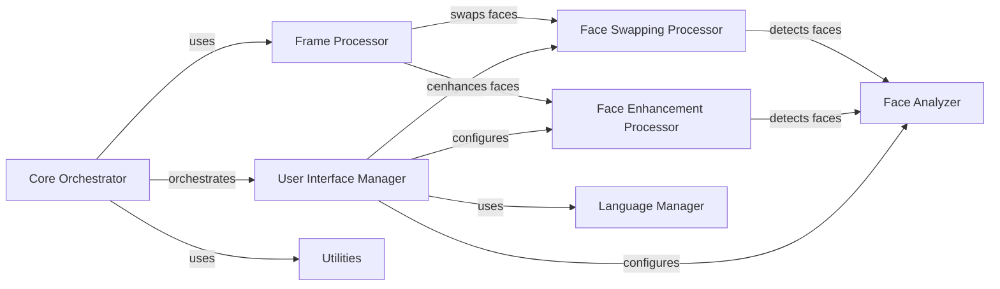

## Component Details

Deep-Live-Cam is a real-time video processing application that allows users to apply various effects to live video feeds or video files. The application is built around a core processing loop that captures frames, applies selected effects such as face swapping or enhancement, and displays the processed output. The user interface provides controls for selecting input sources, configuring processing options, and previewing the results. The application leverages modular components for face detection, image processing, and video encoding/decoding to achieve its functionality.

### Core Orchestrator
The Core Orchestrator is the central component responsible for managing the application's lifecycle. It initializes the application, parses command-line arguments, configures execution providers, and controls the main processing loop. It also handles the creation and destruction of other components and ensures their proper coordination.
- **Related Classes/Methods**: `Deep-Live-Cam.modules.core:parse_args`, `Deep-Live-Cam.modules.core:decode_execution_providers`, `Deep-Live-Cam.modules.core:suggest_execution_providers`, `Deep-Live-Cam.modules.core:pre_check`, `Deep-Live-Cam.modules.core:update_status`, `Deep-Live-Cam.modules.core:start`, `Deep-Live-Cam.modules.core:destroy`, `Deep-Live-Cam.modules.core:run`

### User Interface Manager
The User Interface Manager provides a graphical interface for users to interact with the application. It allows users to select input sources (video files or webcam), configure processing options, preview the output, and start/stop the processing pipeline. It handles user input events and updates the display accordingly, providing a seamless user experience.
- **Related Classes/Methods**: `Deep-Live-Cam.modules.ui:init`, `Deep-Live-Cam.modules.ui:create_root`, `Deep-Live-Cam.modules.ui:analyze_target`, `Deep-Live-Cam.modules.ui:create_source_target_popup`, `Deep-Live-Cam.modules.ui:update_popup_source`, `Deep-Live-Cam.modules.ui:create_preview`, `Deep-Live-Cam.modules.ui:update_tumbler`, `Deep-Live-Cam.modules.ui:select_source_path`, `Deep-Live-Cam.modules.ui:swap_faces_paths`, `Deep-Live-Cam.modules.ui:select_target_path`, `Deep-Live-Cam.modules.ui:select_output_path`, `Deep-Live-Cam.modules.ui:check_and_ignore_nsfw`, `Deep-Live-Cam.modules.ui:toggle_preview`, `Deep-Live-Cam.modules.ui:init_preview`, `Deep-Live-Cam.modules.ui:update_preview`, `Deep-Live-Cam.modules.ui:webcam_preview`, `Deep-Live-Cam.modules.ui:create_webcam_preview`, `Deep-Live-Cam.modules.ui:create_source_target_popup_for_webcam`, `Deep-Live-Cam.modules.ui:refresh_data`, `Deep-Live-Cam.modules.ui:update_webcam_source`, `Deep-Live-Cam.modules.ui:update_webcam_target`

### Face Analyzer
The Face Analyzer component is responsible for detecting and extracting faces from images and videos. It provides functions to identify one or many faces, extract unique faces from target images/videos, and potentially dump face data. This component is a crucial building block for face-related processing tasks.
- **Related Classes/Methods**: `Deep-Live-Cam.modules.face_analyser:get_one_face`, `Deep-Live-Cam.modules.face_analyser:get_many_faces`, `Deep-Live-Cam.modules.face_analyser:get_unique_faces_from_target_image`, `Deep-Live-Cam.modules.face_analyser:get_unique_faces_from_target_video`, `Deep-Live-Cam.modules.face_analyser:dump_faces`

### Frame Processor
The Frame Processor component manages the available frame processors, such as face swapper and face enhancer. It provides functions to get available processors and set them from the UI. This component orchestrates the application of different video processing effects on individual frames.
- **Related Classes/Methods**: `Deep-Live-Cam.modules.processors.frame.core:get_frame_processors_modules`, `Deep-Live-Cam.modules.processors.frame.core:set_frame_processors_modules_from_ui`, `Deep-Live-Cam.modules.processors.frame.core:process_video`

### Face Enhancement Processor
The Face Enhancement Processor component implements face enhancement algorithms to improve the quality of detected faces. It includes functions for pre-checking, pre-starting, enhancing faces, and processing individual frames, frame sequences, and images/videos. This component enhances the visual appeal of faces in the video.
- **Related Classes/Methods**: `Deep-Live-Cam.modules.processors.frame.face_enhancer:pre_check`, `Deep-Live-Cam.modules.processors.frame.face_enhancer:pre_start`, `Deep-Live-Cam.modules.processors.frame.face_enhancer:enhance_face`, `Deep-Live-Cam.modules.processors.frame.face_enhancer:process_frame`, `Deep-Live-Cam.modules.processors.frame.face_enhancer:process_frames`, `Deep-Live-Cam.modules.processors.frame.face_enhancer:process_image`, `Deep-Live-Cam.modules.processors.frame.face_enhancer:process_video`, `Deep-Live-Cam.modules.processors.frame.face_enhancer:process_frame_v2`

### Face Swapping Processor
The Face Swapping Processor component implements face swapping functionality. It includes functions for pre-checking, pre-starting, swapping faces, and processing individual frames, frame sequences, and images/videos. This component allows users to replace faces in the video with other faces.
- **Related Classes/Methods**: `Deep-Live-Cam.modules.processors.frame.face_swapper:pre_check`, `Deep-Live-Cam.modules.processors.frame.face_swapper:pre_start`, `Deep-Live-Cam.modules.processors.frame.face_swapper:swap_face`, `Deep-Live-Cam.modules.processors.frame.face_swapper:process_frame`, `Deep-Live-Cam.modules.processors.frame.face_swapper:process_frame_v2`, `Deep-Live-Cam.modules.processors.frame.face_swapper:process_frames`, `Deep-Live-Cam.modules.processors.frame.face_swapper:process_image`, `Deep-Live-Cam.modules.processors.frame.face_swapper:process_video`, `Deep-Live-Cam.modules.processors.frame.face_swapper:apply_mouth_area`

### Utilities
The Utilities component provides utility functions for video processing, file management, and temporary file handling. It includes functions for extracting frames from videos, creating videos from frames, restoring audio, and managing temporary files. This component supports the video processing pipeline with essential functionalities.
- **Related Classes/Methods**: `Deep-Live-Cam.modules.utilities:extract_frames`, `Deep-Live-Cam.modules.utilities:create_video`, `Deep-Live-Cam.modules.utilities:restore_audio`, `Deep-Live-Cam.modules.utilities:get_temp_frame_paths`, `Deep-Live-Cam.modules.utilities:get_temp_output_path`, `Deep-Live-Cam.modules.utilities:create_temp`, `Deep-Live-Cam.modules.utilities:move_temp`, `Deep-Live-Cam.modules.utilities:clean_temp`

### Language Manager
The Language Manager component manages the application's localization and internationalization, allowing the application to be used in different languages. It provides the necessary tools and functions to translate the user interface and other text elements into different languages.
- **Related Classes/Methods**: `Deep-Live-Cam.modules.gettext.LanguageManager:__init__`