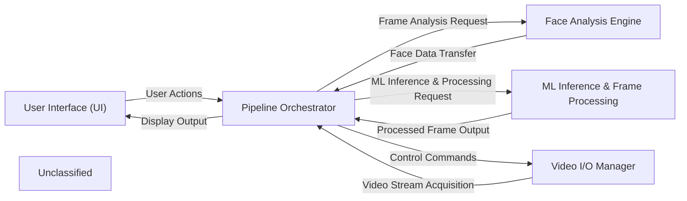

## Details

The Deep-Live-Cam project is structured around a real-time video processing pipeline, designed for dynamic face manipulation and enhancement. At its core, the Pipeline Orchestrator manages the entire data flow, coordinating between video input/output, face analysis, and machine learning inference. The Video I/O Manager handles the acquisition and output of video streams, feeding raw frames to the orchestrator. The User Interface (UI) provides the interactive front-end, allowing users to control the pipeline and visualize processed video. The Face Analysis Engine is responsible for detecting and analyzing facial features within frames. Finally, the ML Inference & Frame Processing component applies various machine learning models for tasks like face swapping, enhancement, and masking, before returning processed frames to the orchestrator for display. This modular design ensures clear separation of concerns and facilitates efficient real-time video processing.

### User Interface (UI) [[Expand]](./User_Interface_UI_.md)
Manages all user interactions, displays video feeds, and provides controls for the application. It serves as the primary interface for users to interact with the ML pipeline.

**Related Classes/Methods**:

- <a href="https://github.com/hacksider/Deep-Live-Cam/blob/main/modules/ui.py" target="_blank" rel="noopener noreferrer">`modules.ui`</a>

### Video I/O Manager
Handles the acquisition of video frames from various sources (e.g., webcam, video files) and is responsible for outputting the final processed video stream.

**Related Classes/Methods**:

- <a href="https://github.com/hacksider/Deep-Live-Cam/blob/main/modules/capturer.py" target="_blank" rel="noopener noreferrer">`modules.capturer`</a>

### Pipeline Orchestrator [[Expand]](./Pipeline_Orchestrator.md)
The central control unit of the ML pipeline. It coordinates the flow of data between different processing stages, ensuring efficient execution and managing the overall pipeline state.

**Related Classes/Methods**:

- <a href="https://github.com/hacksider/Deep-Live-Cam/blob/main/modules/core.py" target="_blank" rel="noopener noreferrer">`modules.core`</a>

### Face Analysis Engine [[Expand]](./Face_Analysis_Engine.md)
Specializes in detecting faces within video frames, extracting facial landmarks, and performing other necessary analyses (e.g., face recognition, attribute extraction) required for subsequent ML processing.

**Related Classes/Methods**:

- <a href="https://github.com/hacksider/Deep-Live-Cam/blob/main/modules/face_analyser.py" target="_blank" rel="noopener noreferrer">`modules.face_analyser`</a>

### ML Inference & Frame Processing [[Expand]](./ML_Inference_Frame_Processing.md)
Executes the core machine learning models for tasks such as face swapping, deepfake generation, and applies various post-processing techniques like enhancement and masking to refine the output frames.

**Related Classes/Methods**:

- <a href="https://github.com/hacksider/Deep-Live-Cam/blob/main/modules/predicter.py" target="_blank" rel="noopener noreferrer">`modules.predicter`</a>
- <a href="https://github.com/hacksider/Deep-Live-Cam/blob/main/modules/processors/frame/face_swapper.py" target="_blank" rel="noopener noreferrer">`modules.processors.frame.face_swapper`</a>
- <a href="https://github.com/hacksider/Deep-Live-Cam/blob/main/modules/processors/frame/face_enhancer.py" target="_blank" rel="noopener noreferrer">`modules.processors.frame.face_enhancer`</a>
- <a href="https://github.com/hacksider/Deep-Live-Cam/blob/main/modules/processors/frame/face_masking.py" target="_blank" rel="noopener noreferrer">`modules.processors.frame.face_masking`</a>

### Unclassified
Component for all unclassified files and utility functions (Utility functions/External Libraries/Dependencies)

**Related Classes/Methods**: _None_

### [FAQ](https://github.com/CodeBoarding/GeneratedOnBoardings/tree/main?tab=readme-ov-file#faq)