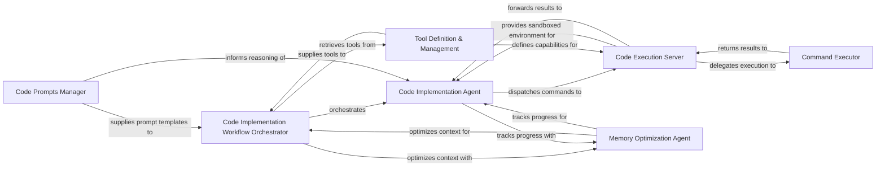

## Details

The `DeepCode` project's code implementation subsystem is orchestrated by the `Code Implementation Workflow Orchestrator`, which manages the entire iterative process of code generation, execution, and error handling. This orchestrator initializes the `Code Implementation Agent`, which is responsible for executing specific implementation tasks and making tool calls. For safe and controlled execution, the `Code Implementation Agent` dispatches commands to the `Code Execution Server`. This server acts as a sandboxed environment, delegating the actual system command execution (Bash) to the `Command Executor`. After execution, results flow back from the `Command Executor` to the `Code Execution Server`, which then forwards them to the `Code Implementation Agent`. Throughout this process, the `Memory Optimization Agent` continuously optimizes conversational memory and tracks file implementation progress, ensuring efficient use of LLM context. Prompt templates are provided by the `Code Prompts Manager` to guide the agents' reasoning, while the `Tool Definition & Management` component centralizes the definitions of available tools for the orchestrator and defines capabilities for the execution server. This architecture ensures a robust, secure, and efficient workflow for AI-driven code implementation.

### Code Implementation Workflow Orchestrator
Orchestrates the end-to-end code implementation process. It manages the iterative loop of code generation, execution, and error handling, initializes the LLM client and the Multi-Component Planning (MCP) agent, prepares tools, and handles user responses and reporting.

**Related Classes/Methods**:

- <a href="https://github.com/HKUDS/DeepCode/blob/main/workflows/code_implementation_workflow.py" target="_blank" rel="noopener noreferrer">`workflows/code_implementation_workflow.py`</a>

### Code Implementation Agent
Acts as the primary agent for executing code implementation tasks. It manages the execution of tool calls, tracks file implementation progress, and applies memory optimization strategies.

**Related Classes/Methods**:

- <a href="https://github.com/HKUDS/DeepCode/blob/main/workflows/agents/code_implementation_agent.py" target="_blank" rel="noopener noreferrer">`workflows/agents/code_implementation_agent.py`</a>

### Code Execution Server
Provides a sandboxed environment for interacting with the file system (reading/writing files) and executing code (Python and Bash commands). It ensures safe and controlled execution of agent-generated code.

**Related Classes/Methods**:

- <a href="https://github.com/HKUDS/DeepCode/blob/main/tools/code_implementation_server.py" target="_blank" rel="noopener noreferrer">`tools/code_implementation_server.py`</a>

### Command Executor
Executes system commands (Bash) and provides structured output. It handles both single and batch command execution, ensuring reliable command-line interactions.

**Related Classes/Methods**:

- <a href="https://github.com/HKUDS/DeepCode/blob/main/tools/command_executor.py" target="_blank" rel="noopener noreferrer">`tools/command_executor.py`</a>

### Code Prompts Manager
Contains the templates and structures for prompts used by the code generation and execution agents. These prompts guide the LLM in planning, writing, and executing code effectively.

**Related Classes/Methods**:

- <a href="https://github.com/HKUDS/DeepCode/blob/main/prompts/code_prompts.py" target="_blank" rel="noopener noreferrer">`prompts/code_prompts.py`</a>

### Memory Optimization Agent
Manages the agent's conversational memory, specifically for code implementation. It extracts file information from plans, tracks implemented files, creates concise summaries, and optimizes messages to fit within LLM context windows.

**Related Classes/Methods**:

- <a href="https://github.com/HKUDS/DeepCode/blob/main/workflows/agents/memory_agent_concise.py" target="_blank" rel="noopener noreferrer">`workflows/agents/memory_agent_concise.py`</a>

### Tool Definition & Management
Provides a centralized definition and retrieval mechanism for the code implementation tools that the Multi-Component Planning (MCP) agent can use.

**Related Classes/Methods**:

- <a href="https://github.com/HKUDS/DeepCode/blob/main/config/mcp_tool_definitions.py" target="_blank" rel="noopener noreferrer">`config/mcp_tool_definitions.py`</a>

### [FAQ](https://github.com/CodeBoarding/GeneratedOnBoardings/tree/main?tab=readme-ov-file#faq)